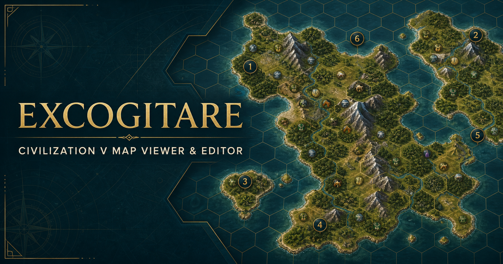
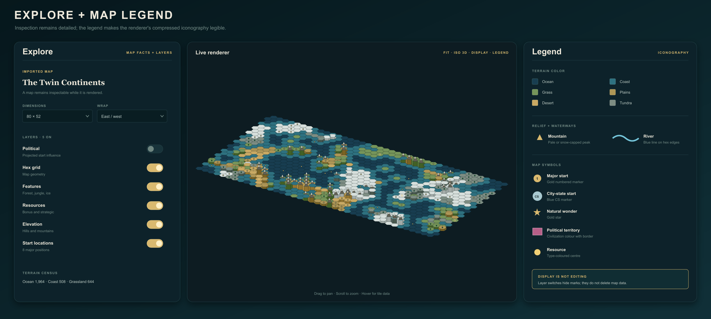
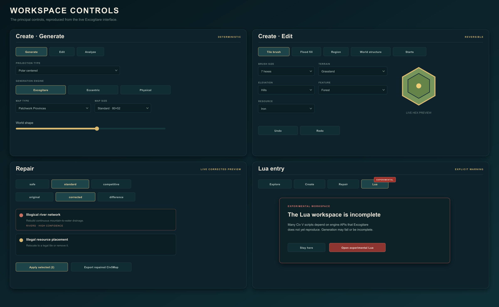
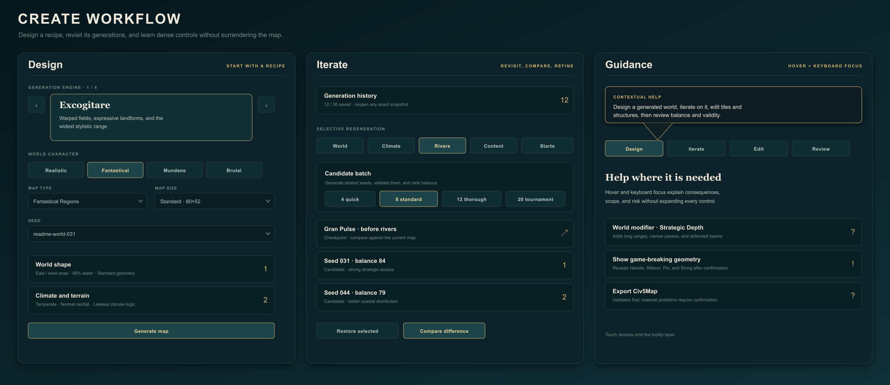
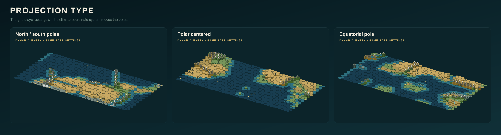
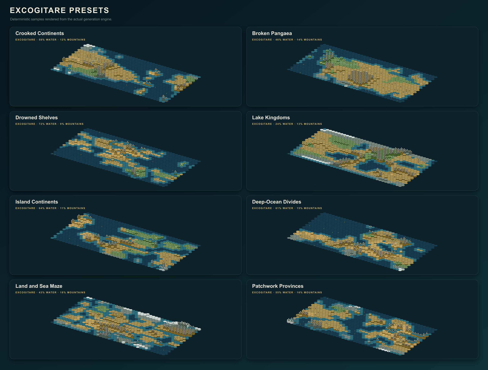
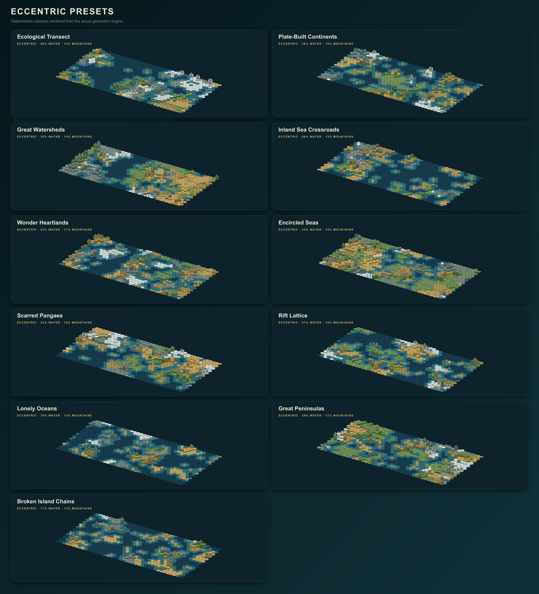
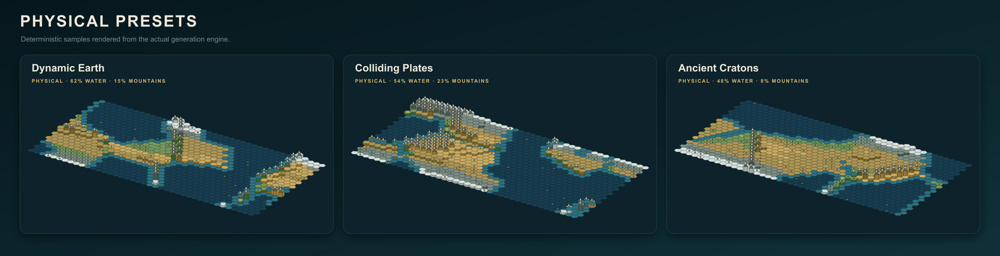
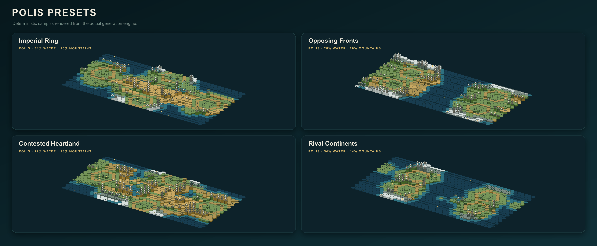

# Excogitare

*excōgitāre* /ɛk.skoː.ɡɪˈtaː.rɛ/ — Latin: to devise, contrive, or think something into being.

A platform-agnostic, browser-based viewer and basic map editor for Civilization V `.Civ5Map` files. Excogitare parses, renders, generates and edits physical maps directly in the browser.

I owe the greatest thanks to [samuelyuan/Civ5MapImage](https://github.com/samuelyuan/Civ5MapImage) who did all the real research and provided all the documentation necessary for me to produce this tool. The native generator's presets take high-level inspiration from [mirror's Fantastical Map Script](https://steamcommunity.com/sharedfiles/filedetails/?id=310024314)'s broad range of world shapes while using an independent implementation. The Physical engine likewise takes high-level inspiration from [Cephalo's PerfectWorld3](https://steamcommunity.com/sharedfiles/filedetails/?id=79814583), particularly its elevation-led landforms and drainage governed by the elevation map. Its expanded climate model is informed by the candidly approximate [Space Calc Climate Simulator](https://space.geometrian.com/calcs/climate-sim.php) and the practical circulation, rain-shadow and biome rules in [How to Color Your Map Using Science](https://mythcreants.com/blog/how-to-color-your-map-using-science/). Excogitare does not copy or execute any of those sources.

Realistic generation adapts [terrain-diffusion](https://github.com/xandergos/terrain-diffusion)'s coarse-conditioning and refinement structure into a lightweight deterministic browser implementation with coupled elevation, temperature, and precipitation fields. Its climate model uses softened regional temperature variation and west-to-east wind carrying moisture over terrain to create windward precipitation and persistent eastern rain shadows. It does not bundle or claim to run the repository's pretrained neural diffusion models.

## AI Disclosure

AI was relied upon heavily for the production of this tool. Often I performed manual review, but more often I did not; although, most of the architecture and logic is my own making—  not always. This was meant to be a quick and dirty tool for making fun makes so that I can while away my waking hours unproductively. None of this is tested for security and if you decide to host this and expose it publicly, you do so at your own risk. 

## Workspaces

The top bar is organized around five workspaces rather than five unrelated menus: **Explore**, **Create**, **Repair**, **Lab** and **Lua**. Selecting a workspace changes the job the sidebar is doing without replacing the current map or disturbing its zoom, pan, layers, history or selections. The switcher gives each workspace a restrained identity—teal Explore, gold Create, copper Repair, blue Lab and red Lua—while retaining written labels so colour is never the only explanation. Lab carries a blue **Development** label; Lua carries a red **Experimental** label. Neither is a claim of maturity.

Create, Repair, Lab and Lua open a dedicated contextual strip beneath the primary header. That strip names the active workspace and stage, exposes only that workspace's stages, and reports useful state such as the generation seed, edit selection, repair count, blind-review progress or Lua runtime status. It is deliberately separate from the top-level switcher: “where am I?” and “what am I doing here?” are related questions, not the same control. Returning to a workspace restores the stage last used there.

These stages are navigation, not a compulsory wizard. Create may move freely between **Design**, **Refine**, **Iterate**, **Edit** and **Review**. Repair separates **Inspect**, **Correct** and **Validate**. Development Lab separates **Review**, **Results** and **Guide**. Experimental Lua separates **Script**, **Generate** and **Diagnostics**. Explore needs no subordinate stage because inspection is already its entire purpose. Every sidebar begins with a task masthead—such as **World Design**, **World Refinement**, **Map Audit**, **Identity Lab** or **Compatibility Report**—and a plain description of that stage. Explore retains the complete map name and description; ordinary working spaces reduce them to a compact **Current map** disclosure. Lab hides the candidate name, description and preset until the reviewer has committed a guess.

## Explore

Open a local `.Civ5Map` with **Open map** or drag one onto the canvas; the parser reads the physical map and whatever scenario records it recognizes, then renders the result without uploading the file. Drag to pan, scroll to zoom, use **Fit** to recover the whole map, and use **ISO 3D** to exchange the normal 2D view for a decorative relief projection. The isometric view has raised hills and mountains, but it remains a renderer rather than a miniature Civ V engine.

The controls in the top bar remain available in the ordinary map workspaces. Lab deliberately substitutes a fixed blind-review view so export names, edit history and display changes cannot disclose or distort a candidate:

- **Undo / Redo** move through edits made during the current session. View position is independent of map state, so an edit should not throw away the current pan or zoom.
- **Export PNG** captures the rendered map with a transparent background. It exports the map, not the surrounding interface.
- **Export Civ5Map** writes the current map using its edited name as the filename. The map name and description remain separately terminated metadata fields, so Civ V's map list displays the name rather than running directly into the description. Generated maps include their major and city-state start slots, supported site improvements, and roads; imported scenario records are preserved where the parser understands them. A confirmation modal appears if validation finds material problems.
- **Open map** loads another `.Civ5Map`. Unsaved in-memory history is not a substitute for keeping the original file.
- **Save project** downloads a portable `.excogitare` project containing the current map, its authoritative generation recipe, retained structural evidence, protection rules, editor view, scenario draft and as many as 30 in-memory generations. **Open project** validates that bundle before replacing the current session. Excogitare has no server-side project store: the downloaded file is the durable copy and must be opened again on a later visit. The present format is a checksummed JSON bundle rather than a compressed archive, so large histories produce large files.
- Clicking the **map name** or **description** offers Edit Mode. Saving changes updates the metadata used by subsequent Civ5Map and PNG exports.

On phone-sized screens Excogitare automatically enters a deliberately reduced mobile view. It presents the map itself, **Randomise & Generate**, and **Download .Civ5Map**—nothing else from the ordinary workspace chrome. The first action chooses a fresh Civ V-safe combination and generates it immediately; the second exports the current result. Turning a phone sideways retains this view when the device reports a coarse touch pointer. Editing, Repair, Lua, layer controls and imported-map work remain desktop tools rather than being crushed into an unusable pocket accordion.

Desktop controls provide contextual help on hover and keyboard focus. These tooltips explain consequences and scope rather than merely repeating a button label: generation settings describe which map systems they affect, editor tools state what they change, Repair profiles state how aggressive they are, and export or canvas controls explain their output. The help surface is fixed above the application so sidebar scrolling and nested panels cannot clip it. Touch devices omit the tooltip layer.

### Display controls and map information

Explore keeps its full inspection sidebar: dimensions, Civ V world-size label, tile count, wrap state, the terrain census and every layer switch remain visible there. The map toolbar's **Display** panel provides the same controls as a quick canvas-side surface, but does not replace Explore's details. Create omits that inspection block so view controls do not interrupt the design workflow. Layer switches affect only the rendering; they do not delete anything from the map. **Legend** remains beside Display because explaining the iconography and deciding which layers to show are related but distinct jobs.

*Explore retains map facts and layer controls beside the renderer. The companion legend translates the compact iconography without pretending that hiding a layer edits the map.*

- **Political** draws scenario territories and borders when ownership records exist. On generated maps it may instead show projected influence around starts. The colours are inferred from stored civilization or team identifiers, not read from Civ V's complete XML database.
- **Strategy graph** appears on Polis generations and overlays safe territories, contested objectives, protected land routes and intended naval or terrestrial fronts. It is the retained pre-terrain design model, not a balance diagram guessed from the finished map.
- **Hex grid** shows the underlying hex geometry.
- **Features** shows forests, jungles, marshes, ice, oases, fallout and other known feature marks.
- **Resources** shows bonus, luxury and strategic resource icons.
- **Elevation** shows hills and mountains and supplies the relief used by ISO 3D.
- **Start locations** shows numbered major-civilization starts when the file stores them.
- **City states** independently shows minor-civilization starts. This is deliberately separate from the major-start layer.
- **Terrain** is a read-only count of the terrain types actually present in the current map.
- **Reset to sample map** discards the current in-memory map and restores Excogitare's demonstration map.

The **Legend** overlay explains terrain colour, coast and river marks, elevation, known features, political and settlement symbols, resources present on the current map, selections and repair highlights. It is descriptive, not an editor, and closes when changing workspace so it cannot sit invisibly over another menu's controls.

### Interface at a glance

*The principal controls reproduced in Excogitare's own palette. The panels are a compact reference rather than a claim that every control fits on one screen.*

The binary format is not blessed with a complete public specification. Unusual versions and heavily modded maps may contain data Excogitare does not recognize, and a successful render proves less than a successful load in Civ V. That distinction is tedious but important.

## Create

Create expands the workspace bar with five non-linear stages: **Design**, **Refine**, **Iterate**, **Edit** and **Review**. Design establishes the world-scale recipe. Refine applies climate, terrain character, content and population without making the user rediscover the structural choices. Iterate revisits generations and reruns selected passes. Edit changes the result directly or protects parts of it from later regeneration. Review reports whether that result is plausible, legal and remotely fair. **Randomise** remains fixed at the top of the Create sidebar and chooses a new safe Standard-effort combination before immediately producing a map. It excludes known game-breaking geometries and tile budgets unless their separate risk control has been enabled.

*Create is arranged as a sequence rather than a thicket: define the world, revisit candidates and checkpoints, then rely on concise contextual help when a control has consequences worth explaining.*

The numbered Design and Refine sections behave as guided sequences, with only one normally expanded at a time. Their summaries report the current choices, and a gold dot marks a section that differs from Excogitare's defaults. Frequently used controls remain visible; specialist simulation, placement and spacing controls live under a **More controls** disclosure within the relevant step. The current recipe and **Generate map** action remain visible at the bottom of the sidebar instead of disappearing after a long scroll.

### Design: world recipe and pole orientation

**World recipe** collects the generation engine, world character, map type, scale, size, effort and seed into a compact starting surface. The four engines are presented as a full-width carousel rather than compressed adjacent tiles. Arrow controls move between engines, selecting a card applies it, and every card keeps its architectural description visible. The remaining recipe controls and advanced disclosures are deliberately flat: Excogitare avoids stacking decorative cards inside other cards merely to consume the sidebar.

**Scale** records whether the intended subject is Global, Continental, Regional, Provincial or Local. It is already part of the versioned recipe and project format, but the generators do not yet reinterpret every narrative, river system or settlement density at every scale; at present it is groundwork rather than a universal simulation control. **Generation effort** selects a deterministic candidate budget: Standard evaluates one candidate, Thorough evaluates four and Exhaustive evaluates twelve before retaining the best legal result. Mobile generation is deliberately restricted to Standard effort and safe map budgets.

**Pole orientation** appears in World shape because it changes the climate coordinate system used by every generation engine without changing the 2D or isometric camera:

- **North / south poles** is the conventional layout: cold poles at the top and bottom with an equator through the middle.
- **Polar centered** places a pole at the centre and radiates climate outward toward an equatorial perimeter.
- **Equatorial pole** treats the horizontal middle axis as the pole and warms toward the top and bottom edges.

*The same Physical-engine concept rendered under each climate projection. Projection moves climate and ice; it does not alter Civ V's rectangular hex adjacency.*

Projection affects temperature, biome placement, ice, polar-land rules and deterministic seeding. It does not change the rectangular Civ V hex grid, invent spherical adjacency, or turn the exported file into a new geometric format. “Projection” is useful shorthand here, not a claim that Civ V has suddenly learned cartography.

**Generation engine** chooses the architecture that constructs the world:

- **Excogitare** is the original field generator: fast warped noise, dramatic coastlines and the broadest stylistic range.
- **Eccentric** is an independent, Fantastical-inspired geographic compiler. It retains a dense irregular mesh—roughly 600 subregions on Duel, 1,300 on Standard and 2,500 on Huge—beneath a hierarchy of polygons. Deep-water barriers divide that graph into navigation basins before continents and islands are allocated. Regional climate realms receive two to four composed biome collections; dissonant borders and coastlines attract mountain ranges; polygon boundaries guide major rivers while subpolygon boundaries guide tributaries. The result is deliberately more eccentric than noise turned up.
- **Physical** is a separate Earth-system approximation rather than Realistic wearing a false moustache. It assigns moving continental and oceanic plates, resolves convergent and divergent boundaries, uplifts and erodes their margins, and derives exact sea level from the requested water share. Climate then emerges from projected insolation, altitude, continentality, axial seasonality, maritime moderation, smoothly blended circulation cells, iterative vapor transport, evaporation demand, rain shadows and runoff. It is substantially more complicated than “wet west, dry east,” because the tropical, temperate and polar winds do not all travel in the same direction.
- **Polis** works in the opposite direction. It compiles a strategic graph of safe territories, contested objectives, land and naval fronts, protected routes and city-state space before terrain exists. Geography is then fitted around that skeleton. Its balance is inspectable rather than implied: the retained graph records nodes, routes, protected tiles, measurements and any constraint that had to be relaxed.

**World character** is an independent modifier, not a fifth engine and not a renamed climate setting. The engine still decides how a world is constructed; Map type still chooses that engine's geographic grammar; World character decides how restrained, coherent, strange or hostile the chosen architecture should be. The sentence beneath the control changes with both selections so that this consequence is visible before generation. It does not silently replace rainfall, climate, advanced-engine or multiplayer settings. Brutal's disclosed Tournament, Balanced-start and minimum-mountain defaults are the deliberate exception.

- **Realistic** favours connected systems, credible causality, moderated extremes and comparatively abundant drainage.
- **Fantastical** favours fragmentation, dramatic relief, strong regional contrast and surprising—but composed—transitions.
- **Mundane** favours broad readable geography, familiar biomes and restrained local drama.
- **Brutal** favours dry interiors, hostile relief, difficult movement and deliberate passes without making land inaccessible. It enforces at least 18% mountains.

The same character therefore has different work to do in each engine:

| Character | Excogitare | Eccentric | Physical | Polis |
| --- | --- | --- | --- | --- |
| Realistic | Refines land and relief fields, follows plate boundaries, cools high ground and transports moisture into west-to-east rain shadows. | Regularises the polygon mesh, strengthens latitude, suppresses contradictory biome collections and favours credible regional boundaries. | Strengthens plate causality, erosion, maritime moderation and atmospheric moisture transport while restraining local climate noise. | Wraps the strategic graph in organic terrain, broad approaches, climate-led biomes and restrained corridor barriers. |
| Fantastical | Maximises coordinate warp, detailed coastlines, regional climate variance and polygon-shaped uplands. | Makes cells more irregular, expands biome collections, permits deliberate contradictions and fragments realms without discarding their selected landmass grammar. | Amplifies crustal heterogeneity, active relief and climate variance while retaining the engine's causal simulation passes. | Crooks fronts, narrows approaches, roughens contested regions and raises dramatic barriers around protected routes. |
| Mundane | Minimises warp, relief and local climate noise to produce broad Civ-like forms. | Regularises regions, blends climates, shortens ranges and restrains local relief. | Favours quiet plates, stronger erosion, subdued relief, low climate variance and conventional broad biomes. | Uses broad readable routes, low terrain noise, generous safe margins and conventional regional climate. |
| Brutal | Builds contested ridges, dries the terrain mix, reduces easy drainage and applies the mountain floor. | Builds dry rugged boundary systems and narrow deliberate passes while preserving accessibility. | Uses violent convergence, weak moisture retention, harsh continentality, rugged relief and the mountain floor. | Compresses fronts, exposes objectives, raises hostile corridor barriers and preserves only deliberate protected passes. |

Character remains part of the deterministic recipe: an identical seed and identical complete settings reproduce the same result. It also follows selective regeneration. Rerunning Climate applies the new character to climate and biome composition while retaining the existing land and elevation; rerunning Rivers changes drainage propensity while retaining terrain, features, resources and wonders.

**Map type** supplies the initial geography and sensible defaults. Selecting one also selects its owning engine.

The complete [Map Type narrative reference](docs/features/map-type-narrative-identities.md) defines the premise, recognizable geography, World Character interpretations and failure conditions for the thirty current types and three approved Polis additions. It is deliberately aspirational where generation remains weaker than the name: the reference is a specification for future implementation, and Three Realms, Thalassic League and Unequal Realms are not yet generator options.

| Engine | Map type | Result |
| --- | --- | --- |
| Excogitare | Crooked Continents | Fjords, inland seas, hooks and difficult interiors make continental exploration unpredictable. |
| Excogitare | Broken Pangaea | One dominant landmass cut by gulfs, rifts and difficult interiors. |
| Excogitare | Drowned Shelves | Compact island mosaics preserve the outlines, uplands and ridges of submerged continents. |
| Excogitare | Lake Kingdoms | Broad terrestrial kingdoms are organized around lakes, enclosed seas and endorheic drainage. |
| Excogitare | Island Continents | Substantial island homelands have real interiors, satellites and consequential voyages. |
| Excogitare | Deep-Ocean Divides | A few monumental ocean barriers gate substantial navigation basins until Astronomy. |
| Excogitare | Land and Sea Maze | Tortuous terrestrial and aquatic corridors make navigation the principal geographic problem. |
| Excogitare | Patchwork Provinces | Contrasting provinces obey different composed geographic, ecological and economic rules. |
| Eccentric | Ecological Transect | One connected landscape tells a causal environmental story through broad transitions. |
| Eccentric | Plate-Built Continents | Every continent records a different authored geological history. |
| Eccentric | Great Watersheds | Land-heavy river basins, inland lakes, wet lowlands and mountain drainage. |
| Eccentric | Inland Sea Crossroads | Great seas crowd scarce marginal land while straits and canal isthmuses control movement. |
| Eccentric | Wonder Heartlands | Monumental regions concentrate wonders and value behind poor or difficult marches. |
| Eccentric | Encircled Seas | A meaningful continuous outer land journey surrounds hierarchical inner waters. |
| Eccentric | Scarred Pangaea | One continent is reorganized by branching alien scars and broad surviving sutures. |
| Eccentric | Rift Lattice | A hierarchical deep-water fracture network defines unequal but viable local worlds. |
| Eccentric | Lonely Oceans | Vast open seas separate small island realms and remote archipelagos. |
| Eccentric | Great Peninsulas | Complete Florida- and Italy-like provinces project between deep gulfs and estuaries. |
| Eccentric | Broken Island Chains | Directional necklaces, crescents and branching arcs preserve visible ancestry. |
| Physical | Dynamic Earth | Mixed moving plates, convergence, rifting, moderate erosion and coupled climate. |
| Physical | Colliding Plates | Young violent collision belts, high ranges, rain shadows and hard interiors. |
| Physical | Ancient Continental Shields | Eroded shields, ghost ranges, mature rivers and exposed mineral cores record deep time. |
| Physical | Volcanic Island Arcs | Rugged volcanic chains curve around sheltered seas and age toward drowned atolls. |
| Physical | Inland Supercontinent | A landbound world drains toward a remote heart behind dry interiors and peripheral highlands. |
| Physical | Monsoon Continents | Strong seasonal contrast draws ocean moisture across warm continental coasts. |
| Physical | Glacial World | Valuable frozen frontiers compel expansion beyond a few temperate refuges. |
| Polis | Imperial Ring | Civilizations surround a contested interior with neighboring fronts and radial approaches. |
| Polis | Opposing Fronts | Players or teams occupy defended sides joined by several readable invasion corridors. |
| Polis | Contested Heartland | Safe territories open toward a valuable central crossroads and flanking routes. |
| Polis | Rival Continents | Balanced continental blocs face one another across naval lanes, islands and limited crossings. |

*The eight field-based Excogitare presets, generated from fixed documentation seeds.*

*The eleven Eccentric presets. Their retained subregions, polygons, navigation basins, biome collections, geographic identities and watersheds are built before content placement.*

Eccentric runs eight retained passes. It builds dense subregions; aggregates them into connected polygons; draws protected deep-water barriers; flood-fills the remaining graph into authoritative Astronomy basins; allocates continents, islands, inland waters and exact shoreline budgets within that architecture; composes regional climates from a separate temperature/rainfall space; raises coherent boundary and coastal ranges; then supplies polygon and subpolygon drainage corridors to Excogitare's Civ V-legal river encoder. Bays, capes, straits, archipelagos, forest realms, wastes and river basins remain attached as private geographic objects for inspection and future editing.

This is not a port of the Lua. It is an independently written TypeScript architecture informed by [zoggop's Fantastical Map Script source](https://github.com/zoggop/Civ5FantasticalMapScript) and attributed accordingly. It does not copy Fantastical's functions, option tables, authored vocabulary or random sequence, and it cannot promise visual identity with version 31. The useful borrowing is conceptual: dense polygonal hierarchy, distinct landmass grammars, navigation basins, regionally composed climates and geography organized along the borders between those regions.

*The seven Physical presets, showing tectonic, maritime, continental, monsoonal and glacial regimes generated by the same retained model.*

Physical runs nine retained passes. Plates and crust establish ownership, motion, uplift and rifting. Exact sea level cuts the resulting hypsometry; erosion then ages relief without deleting active ranges. The engine measures real distance from water, calculates projected annual energy and seasonal range, and builds smoothly blended tropical, temperate and polar winds. Atmospheric vapor is repeatedly advected across the map, recharged over oceans and lakes, partially recycled by wet land, and condensed by rising air and mountain slopes. Temperature, precipitation, cold retention and evaporation demand determine the final water balance and biome. A priority flood then sends runoff to real outlets, accumulates watersheds and provides drainage corridors to the shared Civ V-legal river encoder.

The generated structure retains atmospheric cells, contiguous climate regions, rain shadows, glacial regions and outlet watersheds alongside plates, continents, ocean basins, ranges and rivers. These are inspectable facts about a generated world, not decorative labels inferred from its final colours. A zero-water world deliberately reports no outlet basins and receives no invented ocean-bound rivers.

*The four Polis presets. Starts, safe territories, fronts, objectives and protected routes are compiled before these maps receive terrain.*

Polis runs as a compiler rather than a decorative post-process. It first places major starts according to the requested conflict pattern and symmetry, constructs a connected graph of land and naval fronts, reserves non-overlapping safe territories, and turns every required land route into an immutable passable mask. Only then does it allocate the requested land budget, raise barriers around approaches, resolve climate, place city states, distribute ordinary and contested resources, build legal rivers, and run the same Civ V legality pass as the other engines. A broken or disconnected graph is rejected before geography exists.

Hard rules include legal starts separated by at least five hexes, a connected strategic graph, contiguous front paths, passable protected land routes, legal resource and feature placement, and mountain accessibility. Water percentage, safe-territory radius and requested population are softer because a tiny map cannot obey every extravagant request simultaneously. When those collide with a hard rule, Polis reduces the player or city-state count and records the reduction under **Generated structure** and **Polis strategic audit** rather than crowding illegal starts onto the map.

The **Strategy graph** layer renders that retained model over the map: teal safe territories, gold contested or objective regions, and distinct land, pass and naval front lines. **Review** reports front counts, protected tiles, actual start distance, average front length and any relaxed constraint beside the ordinary multiplayer balance report. Generation history and checkpoints preserve the graph. Exported `.Civ5Map` files do not, because Civ V's format has no ordinary section for Excogitare's private planning model.

**Map size** normally provides Civ V's standard budgets: Duel `40×24`, Tiny `56×36`, Small `66×42`, Standard `80×52`, Large `104×64` and Huge `128×80`. The double-confirmed **Show game-breaking options** permission additionally reveals **Extreme** `180×94` (`16,920` tiles) and **Colossal** `170×110` (`18,700` tiles) in Create and Lua. These are experimental community dimensions informed by [CivV Extreme Map Size](https://github.com/amasarac/CivV_ExtremeMapSize), [Really Huge Map Size](https://steamcommunity.com/sharedfiles/filedetails/?id=2799916578) and community stability reports—not a guarantee that Civ V, WorldBuilder, a particular computer or a mod stack will accept them. Safe Randomise never selects them. Changing size also restores its recommended major- and city-state counts. **Seed** makes a configuration repeatable; **Shuffle** changes only the seed.

### Design: World shape

- **World modifier** applies a second rule over the chosen map type. **None** leaves the preset alone; **Strategic Depth** builds long ranges, narrow passes, defended basins and invasion corridors; **Fractured World** breaks land and water into smaller contested regions; **Doomsday** adds scarred highlands, sparse fallout, ruined cities and remnants of roads.
- **Wrap type** uses the map type's default, forces east-west wrapping, or disables wrapping. It affects adjacency, pathfinding and the exported map flag.
- **Geometry** redistributes the chosen size's approximate tile budget. **Standard** keeps normal proportions; **Tall**, **Wide** and **Square** provide safe alternate shapes. **Needle**, **Ribbon**, **Pin** and **String** are progressively more extreme vertical or horizontal ratios known to crash Civ V. They and the two oversized budgets remain hidden until **Show game-breaking options** is checked and a second modal is confirmed. Only then may Randomise select them. Turning the permission off returns an active unsafe size and geometry to Huge and Standard.
- **Water percent** ranges from 0% to 90%. Zero is intentionally valid. **Mountain percent** ranges from 0% to 38%, except Strategic Depth, Doomsday and Brutal impose their own minimums. The generator opens passes after relief creation so mountains may make travel miserable without sealing land behind an impassable wall.
- **World age** shifts relief toward younger, hillier terrain; normal mature relief; or older, more eroded terrain.
- **Eccentric controls** expose **Fantasticality** (Restrained, Mythic or Unbound), geographic granularity from vast to very fractured forms, one to five authoritative Astronomy basins, whether land may occupy the selected projection's poles, the share of mountain ranges placed along coasts, and sparse, normal or dense hierarchical river networks. On combinations too small or narrow to support a requested basin count, the engine records both requested and achieved counts rather than inventing an invalid topology.
- **Physical controls** set plate activity to quiet, normal or violent; erosion to light, moderate or strong; and river density to sparse, normal or dense. The retained structure records plate motion, crust, boundaries, continents, basins, atmospheric cells, rain shadows, glacial regions, watersheds and major ranges for later inspection.
- **Polis controls** choose a radial contest, opposing fronts, crossroads or rival continents; equivalent, mirrored, rotational or designed-asymmetric geometry; relaxed, standard or immediate expansion pressure; and low, balanced or high naval importance. **Chokepoint density** narrows protected routes and raises barriers around their approaches without blocking the routes themselves. **Safe territory radius** reserves legal, workable land around every major start. If the requested map cannot honor that radius or city-state spacing, Polis reduces the relevant soft constraint and records the relaxation instead of quietly corrupting the map.
- **Reset world shape** restores this group without changing the rest of the design.

### Design: Climate and terrain

- **Climate** shifts the full temperature field toward Cool, Temperate or Hot.
- **Rainfall** shifts moisture toward Arid, Normal or Wet. Physical still runs the full vapor simulation: the setting changes its available water rather than substituting a terrain palette.
- **Rotation** is Physical-only. **Prograde** uses Earth-like easterly tropical winds, westerly temperate winds and polar easterlies. **Retrograde** reverses their east-west component, moving windward coasts and rain shadows without mirroring the land itself.
- **Axial seasonality** is Physical-only. **Mild**, **Earth-like** and **Extreme** alter annual temperature range. High latitudes and continental interiors respond more strongly than ocean-moderated coasts.
- **Ocean influence** is Physical-only. **Weak** permits hard continental temperature and moisture contrasts; **Normal** supplies the default exchange; **Strong** increases maritime moderation and vapor recharge over oceans and lakes.
- **Climate logic** appears in Eccentric's advanced world controls. **Lawless** ignores latitude, **Influenced** lets latitude bias rather than dictate a realm, and **Ordered** makes the selected pole orientation authoritative and applies west-to-east rain shadow.
- **World extreme** is Eccentric-only. **Snowball** compresses the climate into frozen terrain; **Jurassic** produces a hot, wet and heavily vegetated planet; **Arrakis** makes heat and aridity dominant; **Arborea** produces a wet forest world. **None** preserves the full regional spectrum.
- **Region contrast** blends climate borders, keeps varied provinces, or exaggerates them into extreme realms.
- **Dominant terrain** biases generation toward any combination of Grassland, Plains, Desert and Tundra. Selecting nothing leaves the mix to climate. It is a bias rather than permission to put deserts under the sea or snow in a furnace.
- **Reset climate** restores this group and clears terrain dominance.

### Design: Resources and wonders

- **Bonus resources**, **Luxuries** and **Strategics** independently choose scarce, standard or abundant placement.
- **Strategic distribution** spreads deposits evenly, assigns characteristic types to regions, or creates clusters.
- **Guarantee iron and horses** and **Guarantee a luxury** place essential resources near every major start when legal tiles exist.
- **Regional luxury monopolies** concentrates luxury families geographically instead of distributing every type everywhere.
- **Offshore oil** sets the requested share of oil deposits placed at sea.
- **Contested resources** appears for Polis and moves the selected share of ordinary strategic and luxury deposits into contested graph regions. Guaranteed start resources remain local, so competition never removes minimum viability.
- **Natural wonders** sets the target count; **Wonder spacing** separates wonders from one another; **Start buffer** keeps them away from major starts.
- **Barbarians** selects none, scarce, standard or raging camps; **Camp start distance** keeps camps away from starts.
- **Ancient ruins** selects none, scarce, standard or abundant ruins; **Ruin start distance** provides the equivalent buffer.
- **Reset content** restores all resource, wonder, camp and ruin settings.

Camps, ruins, ruined cities, roads, and generated start positions are scenario content. Excogitare now writes those supported records into a fresh scenario section when exporting a generated map. Units, developed cities, diplomacy, technologies, policies, and other full-scenario records remain outside Create; imported maps fare better where their existing scenario structure can be amended rather than invented.

### Design: Players and starts

- **Players** accepts 2–22 major civilizations; **City states** accepts 0–41 minor civilizations. Ordinary size defaults use roughly one city state per major rather than two, leaving more room for actual settlement.
- **Layout: Equal separation** spreads major starts apart. **Tournament** places them with a stricter competitive bias. **Paired teams** enables team controls.
- **Team size** forms teams of two, three or four. **Cluster teammates** keeps allies near one another; **Opposing fronts** arranges teams across contested fronts; **Distributed teammates** separates allies around the world.
- **Start quality: Standard** leaves nearby terrain alone. **Balanced strategic access** guarantees food, iron and horses. **Legendary Start** improves nearby terrain and adds six valuable resources.
- **City-state spacing** may reserve additional room, but five hexes is an absolute minimum between every pair of major and city-state starts. **Distribution** is even or regional. **Coastal preference** permits any tile, favours coasts, or requires coasts when enough legal positions exist. If legal geography cannot fit all requested city states, the generator stores the smaller actual count instead of violating the minimum.
- **Reset players** restores the size's recommended counts and ordinary start rules.

Generated starts are tested for bounds, passable land, duplicates, spacing, mountain isolation and access to the wider landmass. “Balanced” is nonetheless a heuristic, not a theorem and certainly not a tournament organizer willing to accept blame.

### Refine: surface, climate, content and population

Refine contains the controls whose job is to give an established world its inhabitable character. **World Character** still influences the engine's climate and terrain interpretation. **Archetype** is a deterministic coat that can be changed without redrawing land, water, relief, rivers, starts, cities or ownership. Narrative Default leaves generation alone; Existing is the honest default for imported maps; Temperate, Jungle, Sunscourged, Worldfrost, Monsoon, Mediterranean, Steppe, Savanna, Marshland, Volcanic, Jurassic, Post-Collapse and Fallout Wastes repaint legal land terrain and features around the retained topography. An archetype is not a new continent generator and does not pretend to be one.

Refine separates **Apply surface & climate**, **Apply content** and **Apply players & starts** so a useful topography need not be thrown away to revise one layer. The resulting recipe remains attached to the map and is restored with generation history or an Excogitare project. Any selective pass invalidates structural evidence derived from an earlier complete generation until a later full generation rebuilds it.

**Match Intent** records human seats, AI seats, whether AI accommodation should influence design, and which victory conditions are enabled or emphasized. This intent survives history and project export. Polis does not yet use the complete intent model to compile victory-specific front geometry, nor does Review yet prove that a map satisfies each requested victory route; those are explicit remaining parts of the Polis rewrite rather than benefits implied by a handful of checkboxes.

### Iterate: regeneration, candidates and history

- **Generate map** runs all passes in an isolated worker. While running, it becomes a **Cancel** button and reports the active stage.
- **Generation history** keeps the latest 30 generated maps, including their options and seeds, for the current browser session. Opening an entry restores that snapshot. Reloading the page clears the history.
- **Selective regeneration** reruns **World** and every dependent layer; **Climate** and biome features; **Rivers** on the current relief; **Content** such as resources and wonders; or **Starts** including majors, teams and city states.
- **Candidate batch** creates 4, 8, 12 or 20 related seeds, validates them, scores multiplayer balance and ranks the results. Selecting a candidate opens it as the current map.
- **Named checkpoints** save deliberate in-memory revisions. A checkpoint may be restored or compared with the current map; **Difference** highlights changed tiles when dimensions match.

### Edit submenu

- **Tile brush** paints terrain, flat/hill/mountain elevation, features and resources. Each field may be left at **No change**; feature and resource may explicitly be set to **None**. Brush sizes cover 1, 7 or 19 hexes.
- **Flood fill** applies the active fields to a connected region of matching tiles.
- **Region** selects two opposite corners, then copies, pastes or clears the rectangular selection. Paste uses the chosen destination as the copied region's lower-left anchor.
- **World structure** applies a coherent operation to a selected rectangle: raise a tectonic plate, carve a sea basin, build a mountain chain, paint a climate region or rebuild a watershed. Strength may be Subtle, Pronounced or Extreme. Climate painting uses the first dominant terrain selected under Generate, or grassland if none is selected.
- **Start positions** adds or removes numbered major starts by clicking hexes. Team mode groups consecutive player numbers according to the chosen team size.
- **Drag to Preserve** currently records rectangular protected regions across topology, elevation, climate, features, hydrology, content, starts and scenario channels. A retained generated structure may also be protected by semantic identity. Selective regeneration copies protected channels back into the candidate before it replaces the map and refuses hard semantic conflicts where the requested retained object has disappeared. The first version does not yet provide a permanent map overlay, freehand selection, watershed-aware tolerances or the complete Exact / Shape / Relationship policy compiler; the project format preserves the groundwork without pretending those policies already exist.

Edits participate in Undo and Redo, preserve pan and zoom, and are subject to the same export validation as generated content.

### Review submenu

**Multiplayer balance** grades the map and each major start. Player cards report a heuristic score, workable nearby land, strategic resources, luxuries and nearest-opponent distance; selecting a player focuses that start on the map. **Civ5 validation** lists errors, warnings and informational findings involving dimensions, tile legality, rivers, starts, resources and scenario data. Review reports problems but does not alter them; use Edit or Repair for that.

The generator is an independent approximation of Civ V's rules, not Firaxis code. Eccentric independently implements ideas visible in Fantastical's architecture, not its exact tables, random sequence or every eccentric special case. Physical is not a general circulation model: it does not solve fluid dynamics, atmospheric pressure or ocean currents, and its seasonal range chooses a stable map biome rather than adding seasons to Civ V. Generated maps retain private plates, atmospheric cells, rain shadows, watersheds, subregions, polygons, continents, navigation basins, biome collections, geographic identities, strategic regions, Polis fronts, protected routes, mountain ranges and river systems, but `.Civ5Map` has no standard place for all of that model and the renderer does not yet draw a geographic-label layer. Polis balance remains a measured heuristic rather than a mathematical proof that eight human beings will make equally sensible decisions.

## Repair

Repair examines the current map immediately upon entry. Open another `.Civ5Map` while remaining in Repair to run the same parser, salvage and rule checks on that file. Findings are proposals until they are applied or exported from the corrected preview.

### Repair workspace stages

- **Inspect** is deliberately read-only. It presents parser recovery notes, the complete test coverage and every structural, terrain, river, scenario or start-location finding without mixing those results with mutation controls.
- **Correct** selects Safe, Standard or Competitive automation, exposes each proposed mutation, and provides Original, Corrected and Difference views. Checked corrections remain a live preview until **Apply selected** adds them to edit history or **Export repaired Civ5Map** writes the preview directly.
- **Validate** reruns Repair's tests against that corrected preview, including selected corrections that have not yet been committed. It reports blockers or remaining warnings and provides the final repaired export. Passing means Excogitare found no remaining problem in its own rule set; it is not a guarantee about every mod or every obscure Civ V engine limit.

### Repair profiles

- **Safe** preselects the most mechanical corrections with an actual mutation: malformed values, incompatible features, broken city links, impossible city or start placement, city-state flags and player-count mismatches.
- **Standard** includes Safe fixes, illegal resource and wonder cleanup, overlap correction, inaccessible-start relocation and complete river-network rebuilding. This is the ordinary choice.
- **Competitive** retains every Standard fix and adds deterministic whole-layout balancing. Even a legal imported layout may receive a complete major-and-city-state relocation toward more comparable sites while retaining the five-hex floor.

Profiles control which findings are selected, not which tests run. Individual findings may still be checked or unchecked. Each card states its category and confidence, explains the proposed change and, when a tile is involved, offers **Show tile** to focus it.

### Comparison views and actions

- **Original** renders the untouched input.
- **Corrected** is a live preview of all currently selected mutations.
- **Difference** overlays the tiles affected by the proposed repair.
- **File recovery report** appears when the tolerant parser had to salvage truncated or malformed geography. It records what was recovered rather than pretending the damage never existed.
- **Apply selected** commits the checked mutations to the editable current map and makes them available to Undo.
- **Export repaired Civ5Map** exports the corrected preview directly, without requiring the preview to be applied first.

### Tests and corrections

Repair checks dimensions, tile counts and malformed terrain values; illegal terrain, elevation, feature, resource and wonder combinations; fish on land and land resources in impossible terrain; rivers drawn in water, disconnected edge fragments, inland dead ends and drainage that fails to reach an ocean or lake; scenario cities with broken tile links, duplicate identifiers, missing records or impossible placement; and start locations outside the map, on blocked terrain, duplicated, fewer than five hexes apart, misflagged as major or city-state starts, isolated by mountains, absent entirely, or inconsistent with the stored player count.

Illegal resources are relocated to a compatible nearby tile when a defensible destination exists and deleted when it does not. Illegal features and wonders are removed or corrected according to their rule. River repair may discard broken fragments and rebuild a continuous mountain-to-water network because preserving a nonsensical river more faithfully would still leave it nonsensical. Start repair may replace a complete overcrowded layout, correct city-state flags and synchronize the logical player count. A zero-start geography-only map can now receive a fresh scenario section containing spaced major and city-state starts. A file that already contains unrelated scenario data but exposes no writable player slots remains blocked, because replacing that scenario wholesale would be a more destructive intervention than Repair pretends to be.

Repair is useful, but it is not an oracle. Its legality tables know the ordinary content bundled into Excogitare, not every rule introduced by every mod. A strange but intentional river may be replaced by a more conventional one; damaged scenario data may be beyond salvage; and passing every check means only that the map is internally coherent to Excogitare. It does not amount to a blood oath that Civ V will load every possible file. Review Difference and retain the original.

## Lab

Lab is marked **Development** in blue. It is an evidence-gathering workspace for answering a deliberately uncomfortable question: if Excogitare hides the label, can a person still recognize the Map Type? It does not quietly declare a generator successful because a map is attractive, nor does it rewrite generation code from one favorable seed.

The first deck concentrates on four identities whose intended distinctions are large enough to test honestly:

- **Lonely Oceans** tests isolation and negative space: a few viable realms should feel genuinely separated by intimidating water, not merely scattered through an ordinary archipelago.
- **Broken Island Chains** tests correlated island geometry: chains, crescents and branching arcs should read as systems rather than a collection of unrelated islands.
- **Great Watersheds** tests hierarchical hydrology: dominant trunks, merging tributaries, marshes and deltas should organize the world rather than decorate it.
- **Glacial World** tests planetary climate: glaciation, tundra margins and scarce temperate refuges should make the entire map read as a cold world.

These four are starting points, not the only Map Types that will ever enter the Lab. Together they isolate four different generator problems—absence, shape correlation, drainage hierarchy and climate—without pretending that a full-catalogue recognition experiment is useful before the workflow itself has been calibrated.

### Lab workspace stages

- **Review** creates a deterministically shuffled deck. Choose one to five samples per identity, a World Character, map size and stable session seed. Candidate name, description, exact seed and intended preset remain hidden. The Lab fixes the view to flat geography and suppresses editing, export and mutable display controls during the blind judgment.
- **Results** reports first-choice and top-two recognition, counts by identity and the most frequent intended-versus-guessed confusion pairs. A high score is evidence that the narrative is legible; it is not proof of Civ V legality or multiplayer quality.
- **Guide** explains the versioned JSON in the interface, including which fields reproduce a candidate and which fields carry human evidence back to the narrative specification.

For each candidate, select the most likely Map Type within its owning engine and optionally a second choice. Confidence is recorded from 1–5. Cue tags state what was actually perceived—empty ocean, island chains, trunk rivers, ice sheets and so forth—and notes preserve anything the fixed tags fail to say. Only **Submit guess and reveal** exposes the intended identity. A post-reveal verdict distinguishes **Recognizable**, **Ambiguous**, **Attractive but wrong** and **Failed**; this matters because a beautiful map that reads as the wrong narrative is still a failed identity test.

The current session is retained in browser storage on this device. **Export JSON** is the durable development handoff; **Import JSON** restores a compatible session without replacing it when validation fails. The export contains no `.Civ5Map` binary and no account data. It contains exact generation options, which are enough to deterministically regenerate the candidates.

### Reading Identity Lab JSON

The root `schema` is `excogitare.identity-lab`, and `schemaVersion` identifies the evidence format. `narrativeGuide` points to version 1 of [`docs/features/map-type-narrative-identities.md`](docs/features/map-type-narrative-identities.md); that guide states the premise, signature motifs, anti-motifs and engine-specific obligations against which the human review is interpreted.

- `configuration` records the stable session seed, World Character, size, samples per type and prototype list. It defines the experiment rather than any one map.
- `candidates[].options` is the complete deterministic recipe. Use it to reproduce the same map after a generator change.
- `candidates[].intendedPreset` connects that recipe to one narrative entry. The normal interface conceals it until review submission; JSON is a development artifact and therefore does not pretend to remain blind after export.
- `candidates[].review.guessPrimary` and `guessSecondary` produce first-choice and top-two recognition. `confidence`, `cues`, `notes` and `verdict` explain why the numeric result occurred.
- `candidates[].diagnostics` records structural measurements such as land share, river count, islands, ice, marsh and mountain coverage. They help explain a judgment but cannot replace it: a quota can be technically correct while the map still looks generic.
- `summary.byIdentity` aggregates recognition per narrative. `summary.confusions` lists intended and first-choice guessed pairs, making systematic identity collisions visible.

The intended development loop is prosaic on purpose: export a reviewed session, attach the JSON or provide its local path in a later task, compare its confusions, cues, notes and diagnostics with the narrative guide, then change the engine rules across the stable seed deck. Import the session and regenerate the same recipes for the next comparison. A later code change still has to pass legality, accessibility, determinism and World Character tests. The Lab never converts opinion into an automatic generator patch.

The formal implementation record and JSON contract live in [`docs/features/identity-lab.md`](docs/features/identity-lab.md).

## Lua

Lua is marked **Experimental** in red and presents an incomplete-feature warning before entry. That warning is not decorative legal compost: this is the least finished menu. It is a sandboxed compatibility workspace for trying Civ V map scripts, not a faithful copy of the game's Lua host.

### Lua workspace stages

- **Script** loads or replaces the main `.lua`, manages named dependencies, edits the complete source, and stores the optional post-process hook. Editing source or the hook clears stale execution metadata.
- **Generate** contains discovered script options, fallback size, player and city-state counts, runtime seed, and the actual Generate/Regenerate action. A successful run replaces the current map with an ordinary editable Excogitare map.
- **Diagnostics** contains the compatibility report, execution pipeline and captured console output. Keeping these results separate prevents a long failure report from burying the source or generation action.

### Project and generation

- **Open main script / Replace main script** loads one `.lua` file as the project entry point. Its filename and line count are shown.
- **Add dependencies** supplies named `.lua` files referenced by `include()`. Supplied files are listed individually and may be removed. Common helpers such as MapGenerator, bit operations, vectors and starting-plot scaffolding come from the compatibility runtime; mod-specific files do not.
- **Generate map from Lua** runs the project for the first time. **Regenerate map from Lua** reruns it after source, option, dependency, runtime or hook changes. A successful result replaces the current map and becomes an ordinary editable Excogitare map.
- The status line reports preparation, execution, conversion or failure. Execution occurs inside an isolated WebAssembly worker with a strict timeout.

### Controls within the Lua stages

- **Source editor** edits the complete main script in place. This can change generator functions directly; editing clears stale runtime metadata so the next report describes the revised source.
- **Dependencies** lists supplied include files and their line counts. **Add .lua files** may load several at once. Literal named includes can be matched; dynamic or computed include paths generally cannot be discovered in advance.
- **Script options** appears when `GetMapScriptInfo()` returns custom options. Enumerated values become selects; unlabelled numeric choices become number inputs. The selected values are exposed to the script on every run.
- **Runtime** provides a fallback Civ V size, 2–22 major players, 0–41 city states and a deterministic runtime seed. Experimental Extreme and Colossal fallback sizes obey the same double-confirmed Game Breaking permission as Create. `GetMapInitData()` overrides the fallback dimensions and east-west wrap state. Excogitare fills major or city-state starts that the script leaves unassigned.
- **Post-process hook** is a second Lua editor that runs after the main generator. It can call the same supported `Map` and plot APIs to make repeatable programmatic changes without rewriting the original functions.
- **Execution pipeline** lists the discovered plot, terrain, feature, river, continent and related stages, marking each complete or skipped and explaining what occurred.
- **Script console** shows captured output from the run. Missing includes and unsupported calls also feed the compatibility report rather than failing silently where the runtime can identify them.

### Lua exports

- **Export map Lua** emits a static Lua description of the current map. It is useful as generated data, not as a reconstruction of the original procedural algorithm.
- **Export .modinfo** emits companion mod metadata for that exported script.
- **Export Civ5Map** and **Export PNG** remain available in the top bar for the current Lua-generated result.

The compatibility layer covers a growing subset of `Map`, `GameInfo`, plot mutation, enums, database iteration, `Players:SetStartingPlot()` and common map-generator helpers. Fantastical v31 can complete its ordinary default path and expose its nine options, but that does not imply universal Lua compatibility. The database is skeletal, SQL shipped by a mod is not imported, `AssignStartingPlots` remains scaffolding, and many game- or mod-specific APIs are absent. Unsupported natural-wonder feature IDs and resources outside Excogitare's vocabulary may be discarded during capture. Projects are not yet saved as portable multi-file bundles. Exporting an edited map as Lua cannot reverse-engineer brush strokes into the procedural imagination of the original author. That would be alchemy, and this is merely software.

## Docker

`docker-compose` is the recommended deployment method for Excogitare.

## GitHub Pages

Excogitare also has a separate static export for GitHub Pages. This is intentionally parallel to the ordinary Vinext and Alpine builds; Pages does not run the Cloudflare worker and should not be mistaken for a replacement server. The present viewer, generator, editor, repair tools and sandboxed Lua runtime all execute in the browser and therefore remain useful there. Any future account system, shared storage or server-side collaboration would require a real application host.

Run `pnpm run test:pages` to build and verify the static site locally. The finished artifact is written to `out/`, uses `/Excogitare` as its base path, and includes the generated workers, `wasmoon.wasm`, social artwork and other public assets. `out/` is disposable build output and remains ignored by Git.

The workflow in `.github/workflows/pages.yml` performs the same verified build when `main` is pushed or when the workflow is started manually. After committing and pushing these files yourself:

1. Open **Settings → Pages** in the GitHub repository.
2. Set **Build and deployment → Source** to **GitHub Actions**.
3. Open **Actions → Deploy Excogitare to GitHub Pages** and run the workflow if a push has not already started it.
4. Once deployment completes, the project site should be available at `https://angeladmerkel.github.io/Excogitare/`.

If the repository is renamed, change `pagesBasePath` in `next.config.ts` and the Pages URL in that file before rebuilding. GitHub project sites live under the repository name; pretending otherwise merely produces a handsome collection of 404 errors.
