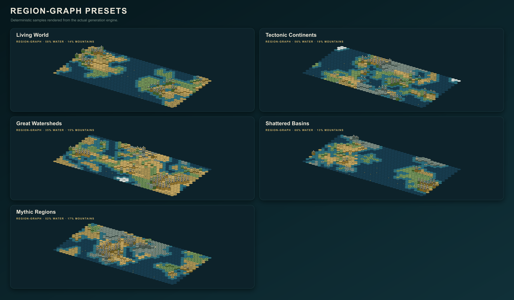

# Excogitare

*excōgitāre* /ɛk.skoː.ɡɪˈtaː.rɛ/ — Latin: to devise, contrive, or think something into being.

A platform-agnostic, browser-based viewer and basic map editor for Civilization V `.Civ5Map` files. Excogitare parses, renders, generates and edits physical maps directly in the browser.

I owe the greatest thanks to [samuelyuan/Civ5MapImage](https://github.com/samuelyuan/Civ5MapImage) who did all the real research and provided all the documentation necessary for me to produce this tool. The native generator's presets take high-level inspiration from [mirror's Fantastical Map Script](https://steamcommunity.com/sharedfiles/filedetails/?id=310024314)'s broad range of world shapes while using an independent implementation. The Physical engine likewise takes high-level inspiration from [Cephalo's PerfectWorld3](https://steamcommunity.com/sharedfiles/filedetails/?id=79814583), particularly its elevation-led landforms, simplified wind climate and drainage governed by the elevation map; Excogitare does not copy or execute its source.

Realistic generation adapts [terrain-diffusion](https://github.com/xandergos/terrain-diffusion)'s coarse-conditioning and refinement structure into a lightweight deterministic browser implementation with coupled elevation, temperature, and precipitation fields. Its climate model uses softened regional temperature variation and west-to-east wind carrying moisture over terrain to create windward precipitation and persistent eastern rain shadows. It does not bundle or claim to run the repository's pretrained neural diffusion models.

## AI Disclosure

AI was relied upon heavily for the production of this tool. Often I performed manual review, but more often I did not; although, most of the architecture and logic is my own making—  not always. This was meant to be a quick and dirty tool for making fun makes so that I can while away my waking hours unproductively. None of this is tested for security and if you decide to host this and expose it publicly, you do so at your own risk. 

## Explore

Open a local `.Civ5Map` with **Open map** or drag one onto the canvas; the parser reads the physical map and whatever scenario records it recognizes, then renders the result without uploading the file. Drag to pan, scroll to zoom, use **Fit** to recover the whole map, and use **ISO 3D** to exchange the normal 2D view for a decorative relief projection. The isometric view has raised hills and mountains, but it remains a renderer rather than a miniature Civ V engine.

The controls in the top bar remain available in every menu:

- **Undo / Redo** move through edits made during the current session. View position is independent of map state, so an edit should not throw away the current pan or zoom.
- **Export PNG** captures the rendered map with a transparent background. It exports the map, not the surrounding interface.
- **Export Civ5Map** writes the current map using its edited name as the filename. Imported scenario records are preserved where the parser understands them. A confirmation modal appears if validation finds material problems.
- **Open map** loads another `.Civ5Map`. Unsaved in-memory history is not a substitute for keeping the original file.
- Clicking the **map name** or **description** offers Edit Mode. Saving changes updates the metadata used by subsequent Civ5Map and PNG exports.

On phone-sized screens Excogitare automatically enters a deliberately reduced mobile view. It presents the map itself, **Randomise & Generate**, and **Download .Civ5Map**—nothing else from the ordinary workspace chrome. The first action chooses a fresh Civ V-safe combination and generates it immediately; the second exports the current result. Turning a phone sideways retains this view when the device reports a coarse touch pointer. Editing, Repair, Lua, layer controls and imported-map work remain desktop tools rather than being crushed into an unusable pocket accordion.

### Layers and map information

The sidebar reports dimensions, Civ V world-size label, tile count, wrap state and a terrain census. Its layer switches affect only the view; they do not delete anything from the map.

- **Political** draws scenario territories and borders when ownership records exist. On generated maps it may instead show projected influence around starts. The colours are inferred from stored civilization or team identifiers, not read from Civ V's complete XML database.
- **Hex grid** shows the underlying hex geometry.
- **Features** shows forests, jungles, marshes, ice, oases, fallout and other known feature marks.
- **Resources** shows bonus, luxury and strategic resource icons.
- **Elevation** shows hills and mountains and supplies the relief used by ISO 3D.
- **Start locations** shows numbered major-civilization starts when the file stores them.
- **City states** independently shows minor-civilization starts. This is deliberately separate from the major-start layer.
- **Terrain** is a read-only count of the terrain types actually present in the current map.
- **Reset to sample map** discards the current in-memory map and restores Excogitare's demonstration map.

The **Legend** overlay explains terrain colour, coast and river marks, elevation, known features, political and settlement symbols, resources present on the current map, selections and repair highlights. It is descriptive, not an editor, and closes when changing workspace so it cannot sit invisibly over another menu's controls.

### Interface at a glance

*The principal controls reproduced in Excogitare's own palette. The panels are a compact reference rather than a claim that every control fits on one screen.*

The binary format is not blessed with a complete public specification. Unusual versions and heavily modded maps may contain data Excogitare does not recognize, and a successful render proves less than a successful load in Civ V. That distinction is tedious but important.

## Create

Create contains three submenus: **Generate**, **Edit** and **Analyze**. Generate builds a deterministic map from a seed and a set of constraints; Edit changes the result directly; Analyze reports whether that result is plausible, legal and remotely fair. **Randomise** at the top chooses a new combination of generation settings and immediately produces a map. It excludes the known game-breaking geometries unless their separate risk control has been enabled.

### Generate: projection and world concept

**Projection Type** is the first control because it changes the climate coordinate system used by every generation engine:

- **North / south poles** is the conventional layout: cold poles at the top and bottom with an equator through the middle.
- **Polar centered** places a pole at the centre and radiates climate outward toward an equatorial perimeter.
- **Equatorial pole** treats the horizontal middle axis as the pole and warms toward the top and bottom edges.

*The same Physical-engine concept rendered under each climate projection. Projection moves climate and ice; it does not alter Civ V's rectangular hex adjacency.*

Projection affects temperature, biome placement, ice, polar-land rules and deterministic seeding. It does not change the rectangular Civ V hex grid, invent spherical adjacency, or turn the exported file into a new geometric format. “Projection” is useful shorthand here, not a claim that Civ V has suddenly learned cartography.

**Generation engine** chooses the architecture that constructs the world:

- **Excogitare** is the original field generator: fast warped noise, dramatic coastlines and the broadest stylistic range.
- **Region-Graph** independently recreates the useful geographic hierarchy behind Fantastical-style maps. Relaxed subregions become polygons; polygon graphs become continents, oceans, inland basins and rifts; climate provinces and mountain boundaries are resolved over that structure; drainage then builds mountain-fed river systems and tributaries.
- **Physical** is a separate PerfectWorld-like simulation rather than Realistic wearing a false moustache. It assigns moving continental and oceanic plates, resolves convergent and divergent boundaries, uplifts and erodes their margins, derives sea level from the requested water share, and couples temperature and atmospheric moisture to projection, altitude, ocean exposure and west-to-east wind.

**World character** is independent of engine:

- **Realistic** favours coupled elevation, temperature, precipitation, softened biome transitions and west-to-east rain shadows.
- **Fantastical** permits stronger warping, stranger regions and less obedient climate.
- **Mundane** keeps shapes and variation closer to an ordinary Civ-like map.
- **Brutal** raises the competitive difficulty with scarce opportunities, hostile relief, narrow routes and tournament-oriented starts. It enforces at least 18% mountains.

**Map type** supplies the initial geography and sensible defaults. Selecting one also selects its owning engine.

| Engine | Map type | Result |
| --- | --- | --- |
| Excogitare | Convoluted Continents | Broad asymmetric continents, hooked peninsulas and broken inland coasts. |
| Excogitare | Broken Pangaea | One dominant landmass cut by gulfs, rifts and difficult interiors. |
| Excogitare | Shattered Isles | Dense island chains, coastal empires and narrow naval routes. |
| Excogitare | Inland Kingdoms | A land-heavy, non-wrapping realm punctured by lakes and irregular inland seas. |
| Excogitare | Earthsea Realms | Numerous irregular continents, isolated minor islands and long voyages. |
| Excogitare | Astronomy Rifts | Fantastical basins divided by deep scars and isolated shelves. |
| Excogitare | Labyrinth Realm | A non-wrapping maze of land bridges, inland channels, chambers and chokepoints. |
| Excogitare | Fantastical Regions | Violently warped coasts and climate regions with little concern for restraint. |
| Region-Graph | Living World | Coherent continents, climate provinces, watersheds and open oceans. |
| Region-Graph | Tectonic Continents | Coastal arcs, interior boundaries, long ranges and sheltered basins. |
| Region-Graph | Great Watersheds | Land-heavy river basins, inland lakes, wet lowlands and mountain drainage. |
| Region-Graph | Shattered Basins | Deep oceans dividing broken continents, island chains and long rifts. |
| Region-Graph | Mythic Regions | Deliberately composed climate realms, epic ranges and implausible transitions. |
| Physical | Dynamic Earth | Mixed moving plates, convergence, rifting, moderate erosion and coupled climate. |
| Physical | Colliding Plates | Young violent collision belts, high ranges, rain shadows and hard interiors. |
| Physical | Ancient Cratons | Quiet old plates, broad river country, subdued uplands and mature coasts. |

*The eight field-based Excogitare presets, generated from fixed documentation seeds.*

*The five Region-Graph presets. Their retained subregions, polygons, basins, climate provinces and watersheds are built before content placement.*

*The three Physical presets, showing active, violent and old eroded tectonic regimes.*

**Map size** provides Civ V's standard budgets: Duel `40×24`, Tiny `56×36`, Small `66×42`, Standard `80×52`, Large `104×64` and Huge `128×80`. Changing size also restores its recommended major- and city-state counts. **Seed** makes a configuration repeatable; **Shuffle** changes only the seed. The configuration summary states the active projection, engine, character, map type, size, final dimensions and player count. When structural metadata exists, **World structure** reports its retained geographic objects and diagnostics.

### Generate: World shape

- **World modifier** applies a second rule over the chosen map type. **None** leaves the preset alone; **Strategic Depth** builds long ranges, narrow passes, defended basins and invasion corridors; **Fractured World** breaks land and water into smaller contested regions; **Doomsday** adds scarred highlands, sparse fallout, ruined cities and remnants of roads.
- **Wrap type** uses the map type's default, forces east-west wrapping, or disables wrapping. It affects adjacency, pathfinding and the exported map flag.
- **Geometry** redistributes the chosen size's approximate tile budget. **Standard** keeps normal proportions; **Tall**, **Wide** and **Square** provide safe alternate shapes. **Needle**, **Ribbon**, **Pin** and **String** are progressively more extreme vertical or horizontal ratios known to crash Civ V. They remain hidden until **Show game-breaking geometry** is checked and a second modal is confirmed. Only then may Randomise select them.
- **Water percent** ranges from 0% to 90%. Zero is intentionally valid. **Mountain percent** ranges from 0% to 38%, except Strategic Depth, Doomsday and Brutal impose their own minimums. The generator opens passes after relief creation so mountains may make travel miserable without sealing land behind an impassable wall.
- **World age** shifts relief toward younger, hillier terrain; normal mature relief; or older, more eroded terrain.
- **Region-Graph controls** expose geographic granularity from vast to very fractured forms, one to five ocean basins, whether land may occupy the selected projection's poles, the share of mountain ranges placed along coasts, and sparse, normal or dense river networks.
- **Physical controls** set plate activity to quiet, normal or violent; erosion to light, moderate or strong; and river density to sparse, normal or dense. The retained structure records plate motion, crust, boundaries, continents, basins and major ranges for later inspection.
- **Reset world shape** restores this group without changing the rest of the design.

### Generate: Climate and terrain

- **Climate** shifts the full temperature field toward Cool, Temperate or Hot.
- **Rainfall** shifts moisture toward Arid, Normal or Wet. Realistic and Physical maps retain west-to-east atmospheric transport, orographic rainfall and eastern rain shadows.
- **Climate logic** appears for Region-Graph. **Free regional climates** permits mythic regions without latitude discipline; **Latitude-informed climates** anchors regional temperatures to the selected Projection Type.
- **Region contrast** blends climate borders, keeps varied provinces, or exaggerates them into extreme realms.
- **Dominant terrain** biases generation toward any combination of Grassland, Plains, Desert and Tundra. Selecting nothing leaves the mix to climate. It is a bias rather than permission to put deserts under the sea or snow in a furnace.
- **Reset climate** restores this group and clears terrain dominance.

### Generate: Resources and wonders

- **Bonus resources**, **Luxuries** and **Strategics** independently choose scarce, standard or abundant placement.
- **Strategic distribution** spreads deposits evenly, assigns characteristic types to regions, or creates clusters.
- **Guarantee iron and horses** and **Guarantee a luxury** place essential resources near every major start when legal tiles exist.
- **Regional luxury monopolies** concentrates luxury families geographically instead of distributing every type everywhere.
- **Offshore oil** sets the requested share of oil deposits placed at sea.
- **Natural wonders** sets the target count; **Wonder spacing** separates wonders from one another; **Start buffer** keeps them away from major starts.
- **Barbarians** selects none, scarce, standard or raging camps; **Camp start distance** keeps camps away from starts.
- **Ancient ruins** selects none, scarce, standard or abundant ruins; **Ruin start distance** provides the equivalent buffer.
- **Reset content** restores all resource, wonder, camp and ruin settings.

Camps, ruins, ruined cities and roads are scenario content. Excogitare can preview and analyze them, but a newly generated geography-first Civ5Map does not yet embed every one of those records in a fresh scenario section. Imported maps fare better because their existing scenario structure can be amended rather than invented.

### Generate: Players and starts

- **Players** accepts 2–22 major civilizations; **City states** accepts 0–41 minor civilizations.
- **Layout: Equal separation** spreads major starts apart. **Tournament** places them with a stricter competitive bias. **Paired teams** enables team controls.
- **Team size** forms teams of two, three or four. **Cluster teammates** keeps allies near one another; **Opposing fronts** arranges teams across contested fronts; **Distributed teammates** separates allies around the world.
- **Start quality: Standard** leaves nearby terrain alone. **Balanced strategic access** guarantees food, iron and horses. **Legendary Start** improves nearby terrain and adds six valuable resources.
- **City-state spacing** defines their minimum separation. **Distribution** is even or regional. **Coastal preference** permits any tile, favours coasts, or requires coasts when enough legal positions exist.
- **Reset players** restores the size's recommended counts and ordinary start rules.

Generated starts are tested for bounds, passable land, duplicates, spacing, mountain isolation and access to the wider landmass. “Balanced” is nonetheless a heuristic, not a theorem and certainly not a tournament organizer willing to accept blame.

### Generate: iteration and history

- **Generate map** runs all passes in an isolated worker. While running, it becomes a **Cancel** button and reports the active stage.
- **Generation history** keeps the latest 30 generated maps, including their options and seeds, for the current browser session. Opening an entry restores that snapshot. Reloading the page clears the history.
- **Selective regeneration** reruns **World** and every dependent layer; **Climate** and biome features; **Rivers** on the current relief; **Content** such as resources and wonders; or **Starts** including majors, teams and city states.
- **Candidate batch** creates 4, 8, 12 or 20 related seeds, validates them, scores multiplayer balance and ranks the results. Selecting a candidate opens it as the current map.
- **Named checkpoints** save deliberate in-memory revisions. A checkpoint may be restored or compared with the current map; **Difference** highlights changed tiles when dimensions match.

### Edit submenu

- **Tile brush** paints terrain, flat/hill/mountain elevation, features and resources. Each field may be left at **No change**; feature and resource may explicitly be set to **None**. Brush sizes cover 1, 7 or 19 hexes.
- **Flood fill** applies the active fields to a connected region of matching tiles.
- **Region** selects two opposite corners, then copies, pastes or clears the rectangular selection. Paste uses the chosen destination as the copied region's lower-left anchor.
- **World structure** applies a coherent operation to a selected rectangle: raise a tectonic plate, carve a sea basin, build a mountain chain, paint a climate region or rebuild a watershed. Strength may be Subtle, Pronounced or Extreme. Climate painting uses the first dominant terrain selected under Generate, or grassland if none is selected.
- **Start positions** adds or removes numbered major starts by clicking hexes. Team mode groups consecutive player numbers according to the chosen team size.

Edits participate in Undo and Redo, preserve pan and zoom, and are subject to the same export validation as generated content.

### Analyze submenu

**Multiplayer balance** grades the map and each major start. Player cards report a heuristic score, workable nearby land, strategic resources, luxuries and nearest-opponent distance; selecting a player focuses that start on the map. **Civ5 validation** lists errors, warnings and informational findings involving dimensions, tile legality, rivers, starts, resources and scenario data. Analyze reports problems but does not alter them; use Edit or Repair for that.

The generator is an independent approximation of Civ V's rules, not Firaxis code. Region-Graph reproduces Fantastical's broad geographic architecture, not its exact tables, random sequence or every eccentric special case. Generated maps retain private plates, subregions, polygons, continents, basins, climate provinces, mountain ranges and river systems, but `.Civ5Map` has no standard place for all of that model and the renderer does not yet draw a geographic-label layer.

## Repair

Repair examines the current map immediately upon entry. Open another `.Civ5Map` while remaining in Repair to run the same parser, salvage and rule checks on that file. Findings are proposals until they are applied or exported from the corrected preview.

### Repair profiles

- **Safe** preselects the most mechanical corrections with an actual mutation: malformed values, incompatible features, broken city links, impossible city or start placement, city-state flags and player-count mismatches.
- **Standard** includes Safe fixes, illegal resource and wonder cleanup, overlap correction, inaccessible-start relocation and complete river-network rebuilding. This is the ordinary choice.
- **Competitive** retains every Standard fix and includes the more opinionated competitive review tier. Very-close starts and unplaced city records currently remain manual-review findings, so Competitive may select the same automated mutations as Standard on an otherwise sound map.

Profiles control which findings are selected, not which tests run. Individual findings may still be checked or unchecked. Each card states its category and confidence, explains the proposed change and, when a tile is involved, offers **Show tile** to focus it.

### Comparison views and actions

- **Original** renders the untouched input.
- **Corrected** is a live preview of all currently selected mutations.
- **Difference** overlays the tiles affected by the proposed repair.
- **File recovery report** appears when the tolerant parser had to salvage truncated or malformed geography. It records what was recovered rather than pretending the damage never existed.
- **Apply selected** commits the checked mutations to the editable current map and makes them available to Undo.
- **Export repaired Civ5Map** exports the corrected preview directly, without requiring the preview to be applied first.

### Tests and corrections

Repair checks dimensions, tile counts and malformed terrain values; illegal terrain, elevation, feature, resource and wonder combinations; fish on land and land resources in impossible terrain; rivers drawn in water, disconnected edge fragments, inland dead ends and drainage that fails to reach an ocean or lake; scenario cities with broken tile links, duplicate identifiers, missing records or impossible placement; and start locations outside the map, on blocked terrain, duplicated, too close, misflagged as major or city-state starts, isolated by mountains, or inconsistent with the stored player count.

Illegal resources are relocated to a compatible nearby tile when a defensible destination exists and deleted when it does not. Illegal features and wonders are removed or corrected according to their rule. River repair may discard broken fragments and rebuild a continuous mountain-to-water network because preserving a nonsensical river more faithfully would still leave it nonsensical. Start repair may move starts, correct city-state flags and synchronize the logical player count.

Repair is useful, but it is not an oracle. Its legality tables know the ordinary content bundled into Excogitare, not every rule introduced by every mod. A strange but intentional river may be replaced by a more conventional one; damaged scenario data may be beyond salvage; and passing every check means only that the map is internally coherent to Excogitare. It does not amount to a blood oath that Civ V will load every possible file. Review Difference and retain the original.

## Lua

Lua is marked **Experimental** in red and presents an incomplete-feature warning before entry. That warning is not decorative legal compost: this is the least finished menu. It is a sandboxed compatibility workspace for trying Civ V map scripts, not a faithful copy of the game's Lua host.

### Project and generation

- **Open main script / Replace main script** loads one `.lua` file as the project entry point. Its filename and line count are shown.
- **Add dependencies** supplies named `.lua` files referenced by `include()`. Supplied files are listed individually and may be removed. Common helpers such as MapGenerator, bit operations, vectors and starting-plot scaffolding come from the compatibility runtime; mod-specific files do not.
- **Generate map from Lua** runs the project for the first time. **Regenerate map from Lua** reruns it after source, option, dependency, runtime or hook changes. A successful result replaces the current map and becomes an ordinary editable Excogitare map.
- The status line reports preparation, execution, conversion or failure. Execution occurs inside an isolated WebAssembly worker with a strict timeout.

### Lua workspace submenus

- **Source editor** edits the complete main script in place. This can change generator functions directly; editing clears stale runtime metadata so the next report describes the revised source.
- **Dependencies** lists supplied include files and their line counts. **Add .lua files** may load several at once. Literal named includes can be matched; dynamic or computed include paths generally cannot be discovered in advance.
- **Script options** appears when `GetMapScriptInfo()` returns custom options. Enumerated values become selects; unlabelled numeric choices become number inputs. The selected values are exposed to the script on every run.
- **Runtime** provides a fallback Civ V size, 2–22 major players, 0–41 city states and a deterministic runtime seed. `GetMapInitData()` overrides the fallback dimensions and east-west wrap state. Excogitare fills major or city-state starts that the script leaves unassigned.
- **Post-process hook** is a second Lua editor that runs after the main generator. It can call the same supported `Map` and plot APIs to make repeatable programmatic changes without rewriting the original functions.
- **Execution pipeline** lists the discovered plot, terrain, feature, river, continent and related stages, marking each complete or skipped and explaining what occurred.
- **Script console** shows captured output from the run. Missing includes and unsupported calls also feed the compatibility report rather than failing silently where the runtime can identify them.

### Lua exports

- **Export map Lua** emits a static Lua description of the current map. It is useful as generated data, not as a reconstruction of the original procedural algorithm.
- **Export .modinfo** emits companion mod metadata for that exported script.
- **Export Civ5Map** and **Export PNG** remain available in the top bar for the current Lua-generated result.

The compatibility layer covers a growing subset of `Map`, `GameInfo`, plot mutation, enums, database iteration, `Players:SetStartingPlot()` and common map-generator helpers. Fantastical v31 can complete its ordinary default path and expose its nine options, but that does not imply universal Lua compatibility. The database is skeletal, SQL shipped by a mod is not imported, `AssignStartingPlots` remains scaffolding, and many game- or mod-specific APIs are absent. Unsupported natural-wonder feature IDs and resources outside Excogitare's vocabulary may be discarded during capture. Projects are not yet saved as portable multi-file bundles. Exporting an edited map as Lua cannot reverse-engineer brush strokes into the procedural imagination of the original author. That would be alchemy, and this is merely software.

## Docker

`docker-compose` is the recommended deployment method for Excogitare.

## GitHub Pages

Excogitare also has a separate static export for GitHub Pages. This is intentionally parallel to the ordinary Vinext and Alpine builds; Pages does not run the Cloudflare worker and should not be mistaken for a replacement server. The present viewer, generator, editor, repair tools and sandboxed Lua runtime all execute in the browser and therefore remain useful there. Any future account system, shared storage or server-side collaboration would require a real application host.

Run `pnpm run test:pages` to build and verify the static site locally. The finished artifact is written to `out/`, uses `/Excogitare` as its base path, and includes the generated workers, `wasmoon.wasm`, social artwork and other public assets. `out/` is disposable build output and remains ignored by Git.

The workflow in `.github/workflows/pages.yml` performs the same verified build when `main` is pushed or when the workflow is started manually. After committing and pushing these files yourself:

1. Open **Settings → Pages** in the GitHub repository.
2. Set **Build and deployment → Source** to **GitHub Actions**.
3. Open **Actions → Deploy Excogitare to GitHub Pages** and run the workflow if a push has not already started it.
4. Once deployment completes, the project site should be available at `https://angeladmerkel.github.io/Excogitare/`.

If the repository is renamed, change `pagesBasePath` in `next.config.ts` and the Pages URL in that file before rebuilding. GitHub project sites live under the repository name; pretending otherwise merely produces a handsome collection of 404 errors.
