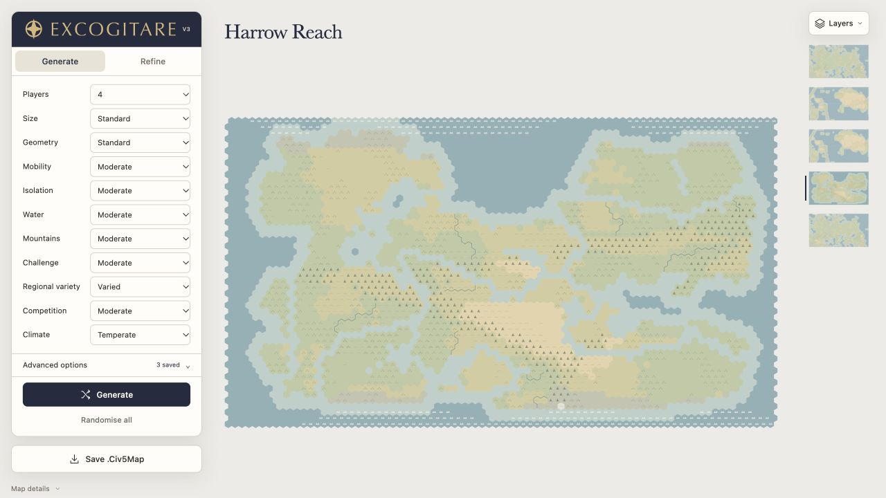
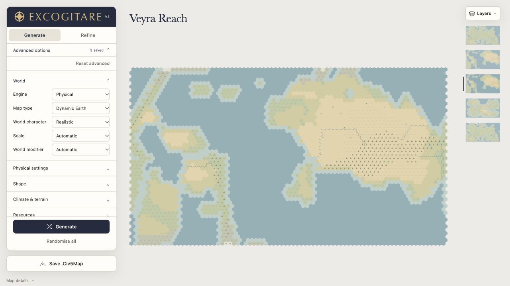
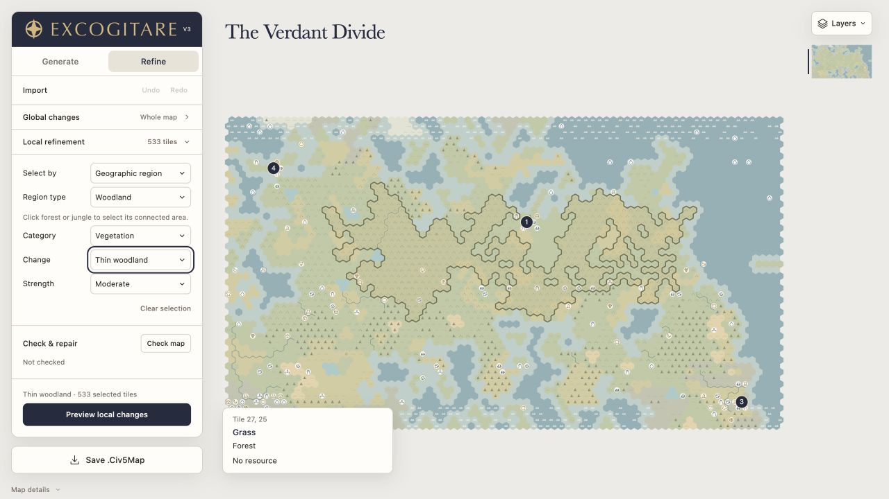
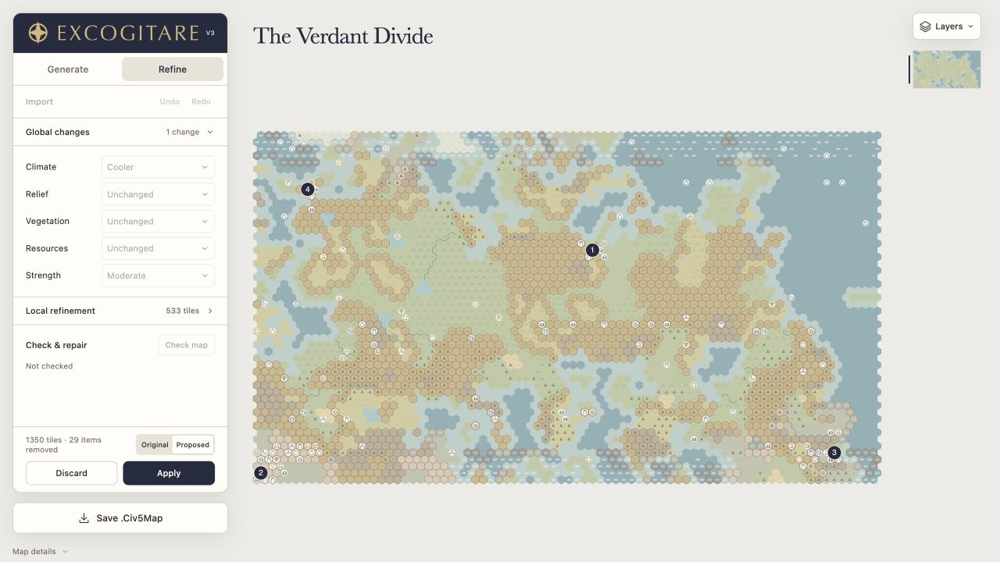
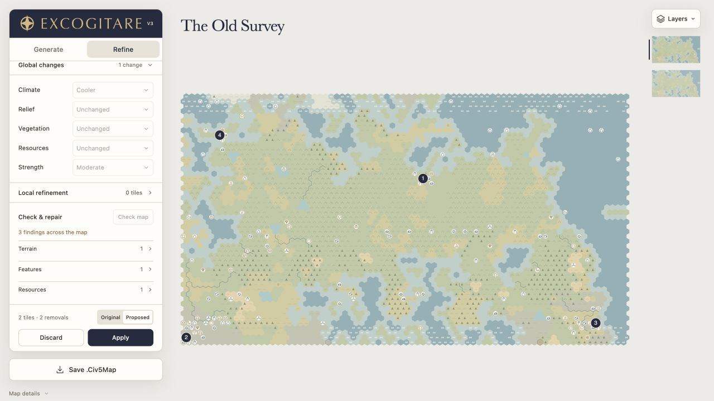
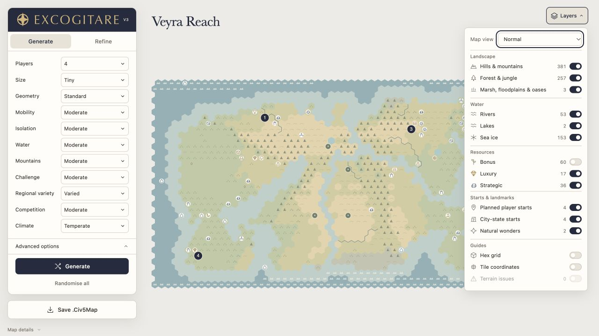
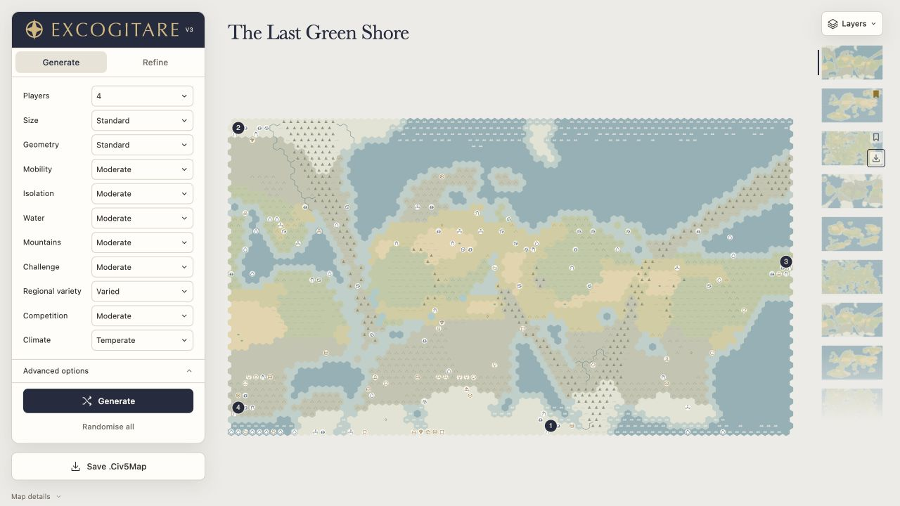
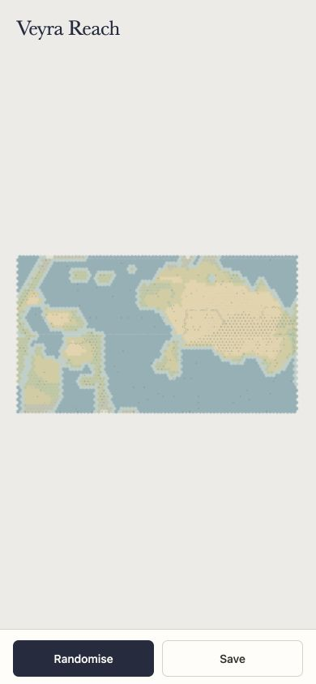

# Excogitare

Generate and refine **Civilization V maps** in your browser. Start with a random world, adjust a few settings, or import an existing `.Civ5Map`.

Generation and editing run locally in your browser. No account is required.



*Generate a world, make small changes in Refine, and save the result as a `.Civ5Map`.*

[Generate](#generate) · [Advanced options](#advanced-options) · [Refine](#refine) · [Layers and history](#layers-and-history) · [Run locally](#run-locally)

## Generate

Start with **Randomise all** to discover a world. It chooses fresh Standard settings, generates the map, then shows the chosen values so you can make small adjustments. **Generate** keeps your settings and creates another map.

Standard describes how you want the world to play. The generator chooses the underlying map type and develops its geography, climate and resources. Geometry defines the available space: local landforms keep consistent proportions while their growth and arrangement respond to the canvas boundaries.

| Control | What it changes |
|---|---|
| **Players** | How many major starting regions to plan. |
| **Size** | The overall map size, from Duel to Colossal. |
| **Geometry** | The map's proportions: standard, wide, tall, square or experimental extremes. |
| **Mobility** | Travel obstacles such as woodland, jungle, marsh and hills. |
| **Isolation** | Separation through oceans, mountain crossings or a dry interior, depending on the other settings. |
| **Water** | How much of the world is sea. |
| **Mountains** | Mountain abundance, separately from Mobility. |
| **Challenge** | Resource abundance and the harshness of the landscape. |
| **Regional variety** | How strongly climate and terrain differ between regions. |
| **Competition** | Pressure around starting regions and contested resources. |
| **Climate** | The world's temperature, from cold to hot. |

Standard generation checks planned starting regions and normalizes nearby resource budgets. This helps compare openings; it does not guarantee equal outcomes in Civ V.

**Map details** shows the seed, premise and assessment notes. While a map is being built, **Cancel generation** preserves your current map.

## Advanced options



*Choose a map type and engine, then open the sections below to customize the world.*

Expand **Advanced options** inside Generate to replace the Standard controls. Collapse it to return. Both sets of settings are retained; Generate uses the visible editor.

- **World:** choose from four engines—Excogitare, Eccentric, Physical and Polis—and 33 map types. Set world character, geographic scale and modifiers, or leave choices on **Automatic**.
- **Shape and climate:** adjust wrapping, pole orientation, water and mountain percentages, world age, rainfall, rivers and terrain archetypes. Additional controls depend on the engine.
- **Resources and starts:** set bonus, luxury and strategic abundance, regional distribution, players, city states, start quality and team geography.
- **Wonders and sites:** adjust natural wonders, barbarian camps and ancient ruins.
- **Seed and effort:** enter a seed to repeat a setup with the same settings and generator version, or change generation effort.

Use **Reset advanced** to return its choices to Automatic. Standard settings remain available when you collapse the section.

## Refine

Work on the current map or choose **Import** to open a `.Civ5Map`. You can also drag a map file onto the canvas.

### Local refinement



*The outlined region is the target. Its tile count appears beside Local refinement.*

Choose **Select by**:

| Selection | How to use it |
|---|---|
| **Geographic region** | Choose a region type, then click the map. Shift-click adds a region; Alt/Option-click removes one. |
| **Area** | Drag a rectangle, or click custom-boundary corners and choose **Finish boundary**. Enter finishes; Escape cancels an unfinished boundary. |
| **Single tile** | Click one hex. |

Choose a **Category**, **Change** and, for larger selections, **Strength**. Available adjustments include adding or thinning woodland, lowering relief, draining marshland, adding suitable oases and relocating resource deposits within the target. **Starts → Review starting balance** opens the existing map view.

Select **Preview local changes**, compare **Original / Proposed**, then **Apply** or **Discard**. The preview reports changed tiles and content removals. Apply creates a history snapshot; **Undo / Redo** steps through accepted edits in the current editing session. Importing or restoring another map starts a new undo sequence.

### Global changes



Choose relative **Climate**, **Relief**, **Vegetation** or **Resources** adjustments and a strength, then **Preview global changes**. Global and local controls keep separate drafts. These operations adjust the existing map; climate changes follow existing terrain and cold-water margins. They do not simulate a new atmospheric or hydrological system.

Resource redistribution preserves deposit types and quantities where legal destinations are available. Edits mark the original generation assessment as out of date; use Layers to inspect the resulting terrain and starting regions.

### Check and correct terrain



Run **Check map** to group supported terrain, feature, resource and natural-wonder placement problems. Expand a group, select findings and click a finding to highlight its location. **Preview corrections** shows the changes and removals before Apply. Large result sets show the first 100 findings; recheck after correcting them.

Try **Map details → Load repair example** for a map with three deliberate problems. Placement checks cover the supported rules; Civ V remains the final check for game compatibility.

## Layers and history



*Numbered markers show planned player starts; smaller green markers show city-state starts. Counts follow the map you are viewing.*

Drag the canvas to pan and scroll to zoom. The map can move behind the controls. **Layers** overlays the canvas without changing your position or zoom:

- **Landscape** controls relief, woodland and wetland features.
- **Water** controls rivers, inferred lake highlights and sea ice.
- **Resources** separates bonus, luxury and strategic deposits, with distinct symbols. Unrecognised resources appear under **Other resources**.
- **Starts & landmarks** shows planned player starts, city-state starts and natural wonders.
- **Guides** adds a hex grid, coordinates when zoomed in, and supported placement issues.

Hover over the map for tile details and resource quantities; the popup disappears when you move away. **Map view** offers Movement, Freshwater, Settlement potential and Starting balance views. Movement and settlement are terrain estimates; balance compares reachable opening terrain rather than predicting game outcomes. Small enclosed coastal water bodies are inferred as lakes. Starting balance requires at least two valid player starts.

Close Layers with its button, **Escape**, or a click outside the menu. Display controls do not change the saved map.



History stores up to **100 snapshots**, newest first. Click a thumbnail to restore it. Hover over a thumbnail, or focus it with the keyboard, to reveal:

- **Bookmark** at the upper right: keeps that snapshot in browser history. Gold means bookmarked; click again to remove the bookmark.
- **Download** at the lower right: saves that snapshot as a `.Civ5Map` without switching away from the current map or a Refine preview.

Bookmarks count toward the 100-snapshot limit. New snapshots replace the oldest unbookmarked one. If all 100 are bookmarked, remove a bookmark before adding another. Generated maps, imports, accepted edits and bookmarks survive reloads in the same browser and site. Clearing site data removes them; download important maps as files. Draft settings and unaccepted previews are not persistent snapshots.

## Keyboard shortcuts

| Key | Action |
|---|---|
| **R** | Randomise all settings and generate a map. |
| **G** | Generate using the current settings. |
| **F** | Fit and centre the map between the controls. |
| **D** | Download the accepted map as `.Civ5Map`. |

Shortcuts work outside input fields. Held keys do not repeat actions, and Ctrl/Command/Alt combinations keep their browser behavior.

## On a phone



The phone interface offers **Randomise** and **Save**. Randomise generates a compact map; use the desktop interface for configuration, imports and editing.

## Export and compatibility

Choose **Save .Civ5Map** beneath the desktop sidebar, or **Save** on a phone, to download the accepted map. Apply a preview first if you want its changes included.

- Exports use Civilization V’s `.Civ5Map` format. Civ VI export and portable project files are not available in V3.
- Civ V chooses starting positions for generated map exports. These may differ from the planned starts shown in the editor and used for resource checks.
- **Extreme**, **Colossal**, **Needle**, **Ribbon**, **Pin** and **String** appear in gold in the dropdowns. These experimental choices may increase memory use or limit starting positions, and Civ V support varies. Randomise all excludes them.
- Placement checks cover supported rules. Test exported maps in Civ V, especially when using mods or experimental dimensions.

## Run locally

With Node.js 24 and pnpm installed:

```sh
pnpm install --frozen-lockfile
pnpm dev
```

Open the address printed in the terminal. The homepage opens V3; the original interface remains at `/legacy`. Its project, scenario and other tools are described in the [original interface guide](docs/legacy-user-guide.md).

## Credits and project status

Map-format research: [Civ5MapImage](https://github.com/samuelyuan/Civ5MapImage). Generation draws inspiration from [Fantastical](https://github.com/zoggop/Civ5FantasticalMapScript), [PerfectWorld3](https://steamcommunity.com/sharedfiles/filedetails/?id=79814583), [terrain-diffusion](https://github.com/xandergos/terrain-diffusion), [Space Calc](https://space.geometrian.com/calcs/climate-sim.php) and [Mythcreants](https://mythcreants.com/blog/how-to-color-your-map-using-science/).

Built with substantial AI assistance; some code has not been manually reviewed. No independent security audit has been performed.
