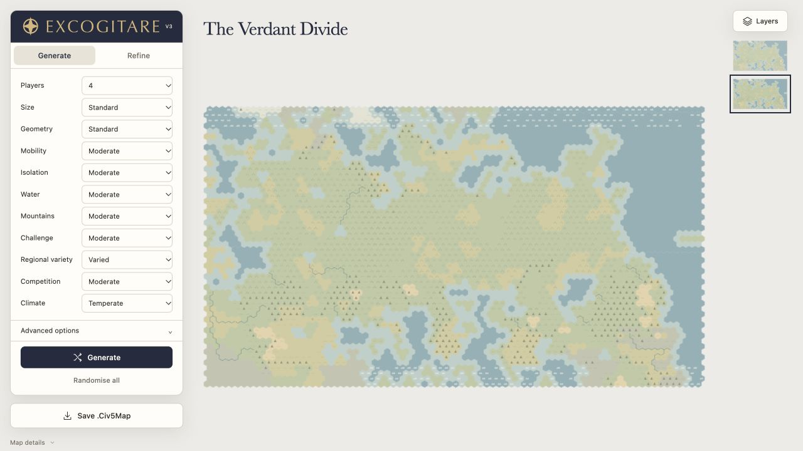

# Excogitare

Generate and refine **Civilization V maps** in your browser. Start with a random world, adjust a few settings, or import an existing `.Civ5Map`.

Generation and editing run locally in your browser. No account is required.



## Generate

- **Generate** creates a new map using your current settings. **Randomise all** chooses fresh settings and generates a map you can then tweak.
- **Standard** controls players, size, geometry, mobility, isolation, water, mountains, challenge, regional variety, competition and climate.
- **Advanced options** exposes engines, map types, terrain, resources, starting conditions and seeds. Standard and Advanced keep separate settings.
- **Map details** shows the generation seed and assessment notes. **Cancel generation** keeps your current map intact.

## Refine

Work on a generated map or choose **Import .Civ5Map** to open an existing one.

1. Use **Select area** to choose where to add woodland or lower mountains.
2. Run **Check terrain** to find supported terrain, feature and resource placement problems.
3. Preview an edit or selected corrections, compare with the original, then **Apply** or **Discard**.

## View and keep maps

Drag the canvas to pan and scroll to zoom. **Layers** controls relief, vegetation, resources, the hex grid and planned starts.

Click a thumbnail on the right to restore an earlier map. The latest **100 snapshots** survive reloads in the same browser and site. Clearing site data removes them, so use **Save .Civ5Map** to keep copies of maps you want to retain.

On phones, the interface offers **Randomise** and **Save**.

## Export and compatibility

- Exports use Civilization V’s `.Civ5Map` format. V3 does not provide portable project files.
- Civ V chooses starting positions for generated map exports. These may differ from the planned starts shown in the editor and used for resource checks.
- **Extreme**, **Colossal**, **Needle**, **Ribbon**, **Pin** and **String** are experimental. Their warning icons explain the risks; Randomise all excludes them.
- Placement checks cover supported rules. Test exported maps in Civ V, especially when using mods or experimental dimensions.

## Run locally

With Node.js 24 and pnpm installed:

```sh
pnpm install --frozen-lockfile
pnpm dev
```

Open the address printed in the terminal. The homepage opens V3; the original interface remains at `/legacy`. Its project, scenario and other tools are described in the [original interface guide](docs/legacy-user-guide.md).

## Credits and project status

Map-format research: [Civ5MapImage](https://github.com/samuelyuan/Civ5MapImage). Generation draws inspiration from [Fantastical](https://github.com/zoggop/Civ5FantasticalMapScript), [PerfectWorld3](https://steamcommunity.com/sharedfiles/filedetails/?id=79814583), [terrain-diffusion](https://github.com/xandergos/terrain-diffusion), [Space Calc](https://space.geometrian.com/calcs/climate-sim.php) and [Mythcreants](https://mythcreants.com/blog/how-to-color-your-map-using-science/).

Built with substantial AI assistance; some code has not been manually reviewed. No independent security audit has been performed.
