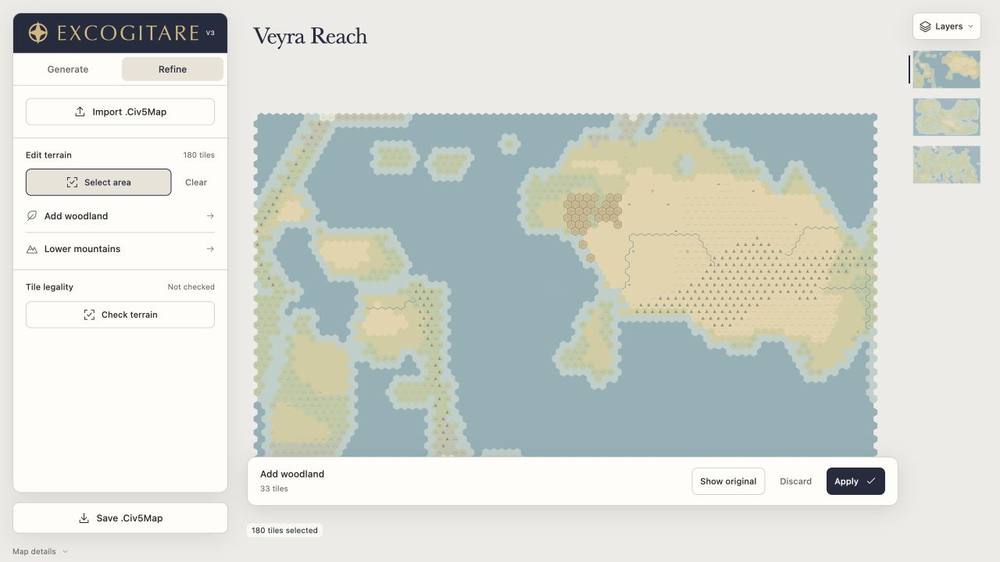
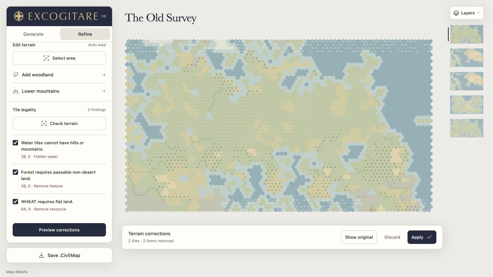
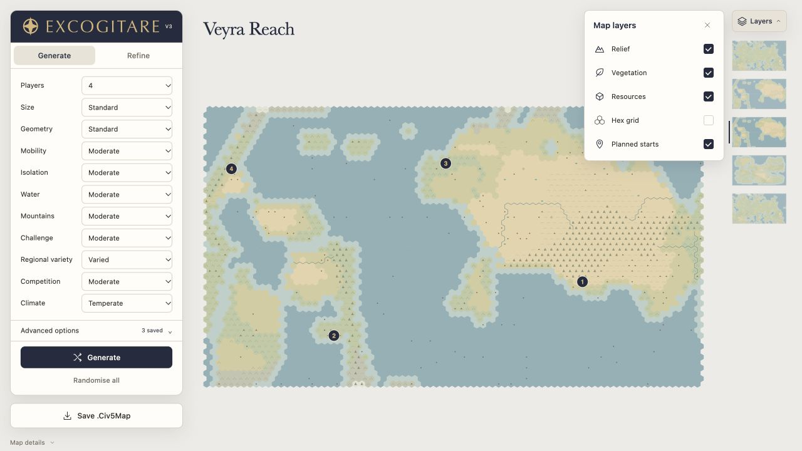

# Excogitare

Generate and refine **Civilization V maps** in your browser. Start with a random world, adjust a few settings, or import an existing `.Civ5Map`.

Generation and editing run locally in your browser. No account is required.


*Generate a world, make small changes in Refine, and save the result as a `.Civ5Map`.*

[Generate](#generate) · [Advanced options](#advanced-options) · [Refine](#refine) · [Layers and history](#layers-and-history) · [Run locally](#run-locally)

## Generate

Start with **Randomise all** to discover a world. It chooses fresh Standard settings, generates the map, then shows the chosen values so you can make small adjustments. **Generate** keeps your settings and creates another map.

Standard describes how you want the world to play. The generator chooses the underlying map type and develops its geography, climate and resources. Geometry defines the available space: local landforms keep consistent proportions while their growth and arrangement respond to the canvas boundaries.

| Control | What it changes |
|---|---|
| **Players** | How many major starting regions to plan. |
| **Size** | The overall map size, from Duel to Colossal. |
| **Geometry** | The map's proportions: standard, wide, tall, square or experimental extremes. |
| **Mobility** | Travel obstacles such as woodland, jungle, marsh and hills. |
| **Isolation** | Separation through oceans, mountain crossings or a dry interior, depending on the other settings. |
| **Water** | How much of the world is sea. |
| **Mountains** | Mountain abundance, separately from Mobility. |
| **Challenge** | Resource abundance and the harshness of the landscape. |
| **Regional variety** | How strongly climate and terrain differ between regions. |
| **Competition** | Pressure around starting regions and contested resources. |
| **Climate** | The world's temperature, from cold to hot. |

Standard generation checks planned starting regions and normalizes nearby resource budgets. This helps compare openings; it does not guarantee equal outcomes in Civ V.

**Map details** shows the seed, premise and assessment notes. While a map is being built, **Cancel generation** preserves your current map.

## Advanced options


*Choose a map type and engine, then open the sections below to customize the world.*

Expand **Advanced options** inside Generate to replace the Standard controls. Collapse it to return. Both sets of settings are retained; Generate uses the visible editor.

- **World:** choose from four engines—Excogitare, Eccentric, Physical and Polis—and 33 map types. Set world character, geographic scale and modifiers, or leave choices on **Automatic**.
- **Shape and climate:** adjust wrapping, pole orientation, water and mountain percentages, world age, rainfall, rivers and terrain archetypes. Additional controls depend on the engine.
- **Resources and starts:** set bonus, luxury and strategic abundance, regional distribution, players, city states, start quality and team geography.
- **Wonders and sites:** adjust natural wonders, barbarian camps and ancient ruins.
- **Seed and effort:** enter a seed to repeat a setup with the same settings and generator version, or change generation effort.

Use **Reset advanced** to return its choices to Automatic. Standard settings remain available when you collapse the section.

## Refine



*Preview changes on the map before applying them. Here, woodland is added to suitable tiles within a selected area.*

Work on a generated map or choose **Import .Civ5Map** to open an existing one. You can also drag a map file onto the canvas.

1. Enable **Select area** and drag across the map to choose a region. With no selection, the editor chooses a small suitable area.
2. Choose **Add woodland** or **Lower mountains**. Changed tiles are highlighted.
3. Use **Show original** to compare, then **Apply** or **Discard**. Applying creates a new snapshot, keeping the previous version in history.

### Check and correct terrain



*The built-in repair example contains three deliberate placement problems. The preview shows which tiles change and how many items will be removed.*

Run **Check terrain** to find supported terrain, feature, resource and natural-wonder placement problems. Each finding names the problem, its coordinates and the proposed correction.

Select the findings you want to fix, then choose **Preview corrections**. Corrections can flatten raised water or remove incompatible content. Compare with the original before applying; discard the preview to leave the map unchanged.

To try this workflow, open **Map details → Load repair example**. Placement checks do not cover every mod rule or prove that a map will load correctly in Civ V.

## Layers and history



*Numbered markers show planned starts. The right-hand thumbnails let you return to generated maps and accepted edits.*

Drag the canvas to pan and scroll to zoom. The map can move behind the controls. **Layers** overlays the canvas without changing your position or zoom:

- **Relief** and **Vegetation** show terrain detail.
- **Resources** reveals resource markers.
- **Hex grid** makes tile boundaries visible.
- **Planned starts** shows the major starting locations evaluated by the generator.

Close Layers with its button, **Escape**, or a click outside the checklist.

History keeps the latest **100 snapshots**, newest first. Click a thumbnail to restore it. Generated maps, imports and accepted edits survive reloads in the same browser and site. Clearing site data removes them; save important maps as files. Draft settings and unaccepted previews are not persistent snapshots.

## On a phone


The phone interface offers **Randomise** and **Save**. Randomise generates a compact map; use the desktop interface for configuration, imports and editing.

## Export and compatibility

Choose **Save .Civ5Map** beneath the desktop sidebar, or **Save** on a phone, to download the accepted map. Apply a preview first if you want its changes included.

- Exports use Civilization V’s `.Civ5Map` format. Civ VI export and portable project files are not available in V3.
- Civ V chooses starting positions for generated map exports. These may differ from the planned starts shown in the editor and used for resource checks.
- **Extreme**, **Colossal**, **Needle**, **Ribbon**, **Pin** and **String** are experimental. Their warning icons explain the risks; Randomise all excludes them.
- Placement checks cover supported rules. Test exported maps in Civ V, especially when using mods or experimental dimensions.

## Run locally

With Node.js 24 and pnpm installed:

```sh
pnpm install --frozen-lockfile
pnpm dev
```

Open the address printed in the terminal. The homepage opens V3; the original interface remains at `/legacy`. Its project, scenario and other tools are described in the [original interface guide](docs/legacy-user-guide.md).

## Credits and project status

Map-format research: [Civ5MapImage](https://github.com/samuelyuan/Civ5MapImage). Generation draws inspiration from [Fantastical](https://github.com/zoggop/Civ5FantasticalMapScript), [PerfectWorld3](https://steamcommunity.com/sharedfiles/filedetails/?id=79814583), [terrain-diffusion](https://github.com/xandergos/terrain-diffusion), [Space Calc](https://space.geometrian.com/calcs/climate-sim.php) and [Mythcreants](https://mythcreants.com/blog/how-to-color-your-map-using-science/).

Built with substantial AI assistance; some code has not been manually reviewed. No independent security audit has been performed.
